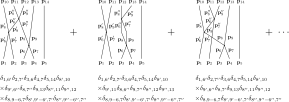
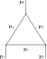

.. _sec_the_cluster_decomposition_principle:

The Cluster Decomposition Principle
===================================

Nearly all modern texts on quantum field theory use the so-called *creation* and *annihilation* operators to describe Hamiltonians, but few explain why it is the way it is. Historically speaking, this formalism grew out of the so-called *canonical quantization* of electromagnetic fields. But of course we prefer logical reasons over historical ones, and it is the goal of this chapter to explain how this formalism leads to an S-matrix that satisfies the so-called cluster decomposition principle, or in plain words, that in effect distant experiments yield uncorrelated results. This is a quite fundamental assumption to keep because otherwise it'd be impossible to make an "isolated" experiment.

Bosons and Fermions
-------------------

We will now address an issue we left behind from :eq:`eq_many_particles_state_normalization_rough`, namely, the permutations of particles in a many-particles state

.. math:: \Phi_{\pbf_1, \sigma_1, n_1; ~\pbf_2, \sigma_2, n_2; ~\cdots}

Note that we've used the :math:`3`-momenta instead of the :math:`4`-momenta to label the particles since we implicitly assume that the particles are all living on their mass shells. Moreover, we've decided to use the free particles states, which could equally well be in- or out-states. Since there is really no ordering of the particles, it's conceivable that any swap of two particles should just give the same state back. More precisely, there should exist a phase :math:`\alpha = \alpha(\pbf, \sigma, n; \pbf', \sigma', n')`, which depends a priori on the swapping particles, such that

.. math::
	:label: eq_factor_alpha_for_swapping_two_particles

	\Phi_{\cdots \pbf, \sigma, n; ~\cdots ~\pbf', \sigma', n'; ~\cdots} = \alpha \Phi_{\cdots \pbf', \sigma', n'; ~\cdots ~\pbf, \sigma, n; ~\cdots}

First of all, let's first argue why :math:`\alpha` should not depend on the other particles that appear in the states. This is in fact another essence of the cluster decomposition principle, namely, what happens between two particles should not depend on other unrelated particles, that in principle can be arbitrarily far away. Next, we argue that :math:`\alpha` should not depend on the spin :math:`z`-component (or the helicity for massless particles). This is because :math:`\alpha` would otherwise have to furnish a :math:`1`-dimensional representation of the rotation group, which, as we've seen in :ref:`Clebsch-Gordan coefficients <dropdown_clebsch_gordan_coefficients>`, doesn't exist. Finally, if :math:`\alpha` would depend on the momenta of the two swapping particles, then the Lorentz invariance would demand that the dependency takes the form of :math:`p^i p'_i` which is symmetric under the swap. Hence we can conclude, by applying :eq:`eq_factor_alpha_for_swapping_two_particles` twice, that :math:`\alpha^2 = 1`.

.. warning::
	The argument above that led to the conclusion :math:`\alpha^2 = 1` neglected a possibility that :math:`\alpha` depends on the path that the particle are brought to the momenta :math:`\pbf_1, \pbf_2` and so on. We will come back to this point (much) later.

Now the question has become: should :math:`\alpha` be :math:`1` or :math:`-1`? At this point we shall just make up a story as follows. In this world there exist two types of particles, known as bosons and fermions, such that :math:`\alpha = -1` if the two swapping particles are both fermions and :math:`\alpha = 1` otherwise. This is really a convention rather than any sort of dark magic -- we could have from the beginning agreed upon a rule about how the particles should be ordered and always write states in that order. This convention, however, will turn out to be *mathematically* convenient when we have to deal with symmetries that involve multiple particles, such as the isospin symmetry.

We can now fix the signs in :eq:`eq_many_particles_state_normalization_rough`. For the simplicity of notations, we shall write :math:`q \coloneqq (\pbf, \sigma, n)`, when details of the particle states are not important, so that a state can be shorthanded as :math:`\Phi_{q_1 q_2 \cdots q_N}`. In this notation :eq:`eq_many_particles_state_normalization_rough` can be written as follows

.. math::

	\left( \Phi_{q'_1 q'_2 \cdots q'_M}, \Phi_{q_1 q_2 \cdots q_N} \right) = \delta_{MN} \sum_{\Pscr} \delta_{\Pscr} \prod_i \delta(q'_i - q_{\Pscr i})

where :math:`\Pscr: \{1, 2, \cdots, N\} \to \{1, 2, \cdots, N\}` is a permutation and :math:`\delta_{\Pscr} = -1` if and only if :math:`\Pscr`, written as a product of swaps, contains an odd number of swaps of fermions.

Creation and Annihilation Operators
-----------------------------------

In a nutshell, creation and annihilation operators provide us a different way to write states like :math:`\Phi_{q_1 \cdots q_N}` and to write operators, e.g., the Hamiltonian, that act on the states. In this section, we shall

1. define the creation and annihilation operators by how they act on particle states,
2. calculate their (anti-)commutator,
3. show how to write *any* operator in terms of the creation and annihilation operators, and
4. work out the Lorentz and CPT transformation laws.

Definition of the operators
+++++++++++++++++++++++++++

Let's start with the creation operator that "creates" a particle with quantum numbers :math:`q` as follows

.. math::
	:label: eq_defn_creation_operator

	a^{\dagger}(q) \Phi_{q_1 q_2 \cdots q_N} \coloneqq \Phi_{q q_1 q_2 \cdots q_N}

By introducing a special state :math:`\Phi_{\VAC}`, called the *vacuum state*, which is a state with no particles, we can express any state as follows

.. math::
	:label: eq_particles_state_from_creation_operators

	\Phi_{q_1 q_2 \cdots q_N} = a^{\dagger}(q_1) a^{\dagger}(q_2) \cdots a^{\dagger}(q_N) \Phi_{\VAC}

The adjoint of :math:`a^{\dagger}(q)`, denoted by :math:`a(q)`, is then the annihilation operator, which "removes" a particle from the state. Unlike the the creation operator, which according to :eq:`eq_defn_creation_operator` always add from the left to the list of existing particles, the annihilation operator necessarily needs to be able to remove the particle from anywhere in the state due to the permutation symmetry discussed in the previous section. To work out the formula for :math:`a(q)`, let's first write down the most general expression as follows

.. math::
	:label: eq_indeterminate_annihilation_formula

	a(q) \Phi_{q_1 \cdots q_N} = \sum_{i=1}^N \sigma(i) \delta(q - q_i) \Phi_{q_1 \cdots \hat{q}_i \cdots q_N}

where the hat means that the corresponding term is missing, and :math:`\sigma(i) = \pm 1` are the indeterminants that we need to solve for. Next we pair it with a test state :math:`\Phi_{q'_1 q'_2 \cdots q'_N}` and calculate the result in two ways. The first is a direct calculation using :eq:`eq_indeterminate_annihilation_formula`

.. math::

	\left( \Phi_{q'_1 \cdots q'_{N-1}}, a(q) \Phi_{q_1 \cdots q_N} \right) &= \sum_{i=1}^N \sigma(i) \delta(q - q_i) \left( \Phi_{q'_1 \cdots q'_{N-1}}, \Phi_{q_1 \cdots \hat{q}_i \cdots q_N} \right) \\
		&= \sum_{i=1}^N \sum _{\Pscr} \sigma(i) \delta(q - q_i) \delta_{\Pscr} \prod_{j=1}^{N-1} \delta(q'_j - q_{\Pscr j})

where :math:`\Pscr: \{1, 2, \cdots, N-1\} \to \{1, 2, \cdots, \hat{i}, \cdots, N\}` is a bijection. The second calculation uses the fact that :math:`a` and :math:`a^{\dagger}` are adjoint operators

.. math::

	\left( \Phi_{q'_1 \cdots q'_{N-1}}, a(q) \Phi_{q_1 \cdots q_N} \right) &= \left( a^{\dagger}(q) \Phi_{q'_1 \cdots q'_{N-1}}, \Phi_{q_1 \cdots q_N} \right) \\
		&= \left( \Phi_{q q'_1 \cdots q'_{N-1}}, \Phi_{q_1 \cdots q_N} \right) \\
		&= \sum_{i=1}^N \sum_{\Pscr'} \delta_{\Pscr'} \delta(q - q_i) \prod_{j=1}^{N-1} \delta(q'_j - q_{\Pscr' j}) \\
		&= \sum_{i=1}^N \sum_{\Pscr} (\pm 1)^{c_i} \delta_{\Pscr} \delta(q - q_i) \prod_{j=1}^{N-1} \delta(q'_j - q_{\Pscr j})

A few notes are in order to explain the above calculation

1. If we think of :math:`q` in :math:`\Phi_{q q'_1 \cdots q'_{N-1}}` as having index :math:`0`, then :math:`\Pscr': \{0, 1, 2, \cdots, N-1\} \to \{1, 2, \cdots, N\}` is a bijection such that :math:`\Pscr' 0 = i` and the rest being the same as :math:`\Pscr`.
2. The sign in :math:`\pm 1` is positive if :math:`q` is a boson and negative if :math:`q` is a fermion.
3. The power :math:`c_i` counts the number of fermions among :math:`q_1, \cdots, q_{i-1}` because the map :math:`\Pscr' 0 = i` can be realized by a product of :math:`i` swaps :math:`(0 \leftrightarrow 1)(1 \leftrightarrow 2) \cdots (i-1 \leftrightarrow i)` and only those swaps with a fermion may contribute a :math:`-1`.

Comparing the results of the two ways of calculating the same quantity, we see that :math:`\sigma(i) = (\pm 1)^{c_i}` and therefore can rewrite :eq:`eq_indeterminate_annihilation_formula` as follows

.. math::
	:label: eq_defn_annihilation_operator

	a(q) \Phi_{q_1 \cdots q_N} = \sum_{i=1}^N (\pm 1)^{c_i} \delta(q - q_i) \Phi_{q_1 \cdots \hat{q}_i \cdots q_N}

Note that :math:`a(q)` annihilates the vacuum state :math:`\Phi_{\VAC}`, whether :math:`q` is boson or fermion, since there is no state that contains :math:`-1` particles.

.. note::
	Although :math:`a^{\dagger}(q)` and :math:`a(q)` are called the creation and annihilation operators and they indeed appear to add and remove particles from a state, respectively, at least in our framework, it is really more of a mathematical convenience than anything physically realistic -- one should not imagine particles getting created or destroyed like magic.

The (anti-)commutation relation
+++++++++++++++++++++++++++++++

Just like all the operators we've encountered so far, it'll be important to calculate some sort of commutator :math:`\left[ a(q'), a^{\dagger}(q) \right]`. The calculation naturally splits into two halves. The first half, using :eq:`eq_defn_creation_operator` and :eq:`eq_defn_annihilation_operator` is as follows

.. math::

	a(q') a^{\dagger}(q) \Phi_{q_1 \cdots q_N}
		&= a(q') \Phi_{q q_1 \cdots q_N} \\
		&= \delta(q' - q) \Phi_{q_1 \cdots q_N} + \blue{\sum_{i=1}^N (\pm 1)^{c'_i} \delta(q' - q_i) \Phi_{q q_1 \cdots \hat{q}_i \cdots q_N}}

where the power :math:`c'_i = c_i + 1` if both :math:`q` and :math:`q'` are fermions, and :math:`c'_i = c_i` otherwise.

The second half, using :eq:`eq_defn_annihilation_operator` and :eq:`eq_defn_creation_operator`, is done as follows

.. math::

	a^{\dagger}(q) a(q') \Phi_{q_1 \cdots q_N}
		&= a^{\dagger}(q) \sum_{i=1}^N (-1)^{c_i} \delta(q' - q_i) \Phi_{q_1 \cdots \hat{q}_i \cdots q_N} \\
		&= \blue{\sum_{i=1}^N (\pm 1)^{c_i} \delta(q' - q_i) \Phi_{q q_1 \cdots \hat{q}_i \cdots q_N}}

Now we would like to combine the two halves to cancel the blue expressions. More precisely, we need to sum up the two if both :math:`q` and :math:`q'` are fermions, and subtract the two otherwise. The result can be formulated as follows

.. math::
	:label: eq_creation_annihilation_commutator

	\left[ a(q'), a^{\dagger}(q) \right]_{\pm} \coloneqq a(q') a^{\dagger}(q) \pm a^{\dagger}(q) a(q') = \delta(q' - q)

where the sign :math:`\pm` is positive if both :math:`q` and :math:`q'` are fermions, and negative otherwise.

Moreover, one can use the definitions :eq:`eq_defn_creation_operator` and :eq:`eq_defn_annihilation_operator` to show the following complementing identities

.. math::

	\left[ a^{\dagger}(q'), a^{\dagger}(q) \right]_{\pm} &= 0 \\
	\left[ a(q'), a(q) \right]_{\pm} &= 0

with the same sign convention as in :eq:`eq_creation_annihilation_commutator`.

A universal formula of operators
++++++++++++++++++++++++++++++++

We will show that any operator (on states) :math:`\Ocal` can be written as a sum of products of creation and annihilation operators as follows

.. math::
	:label: eq_general_operator_expansion_in_creation_and_annihilation

	\Ocal &= \sum_{N=0}^{\infty} \sum_{M=0}^{\infty} \int dq'_1 \cdots dq'_N dq_1 \cdots dq_M \\
		&\quad \times a^{\dagger}(q'_1) \cdots a^{\dagger}(q'_N) a(q_M) \cdots a(q_1) \\
		&\quad \times C_{NM}(q'_1, \cdots, q'_N, q_1, \cdots, q_M)

where :math:`C_{NM}(q'_1, \cdots, q'_N, q_1, \cdots, q_M)` are the coefficients to be determined. Indeed the coefficients :math:`C_{NM}` can be worked out by induction as follows. The base case if when :math:`N = M = 0`, where we simply define

.. math::
	:label: eq_defn_c00

	C_{00} \coloneqq \left( \Phi_{\VAC}, \Ocal \Phi_{\VAC} \right)

Now suppose inductively that :math:`C_{NM}` have been defined for all :math:`N < L, M \leq K` or :math:`N \leq L, M < K`. Then one calculates

.. math::

	\left( \Phi_{q'_1 \cdots q'_L}, \Ocal \Phi_{q_1 \cdots q_K} \right) &= L!~K!~C_{LK}(q'_1 \cdots q'_L, q_1, \cdots q_K) \\
		&\quad + \text{ terms involving } C_{NM} \text{ with } N < L, M \leq K \text{ or } N \leq L, M < K

where the factorials :math:`L!` and :math:`K!` are included to account for the total permutations of :math:`q'_1, \cdots, q'_L` and :math:`q_1, \cdots q_K`, respectively. The coefficient :math:`C_{LK}` is therefore uniquely determined, and hence all :math:`C_{NM}` by induction.

.. note::
	In :eq:`eq_general_operator_expansion_in_creation_and_annihilation` we've chosen a specific ordering of the creation and annihilation operators, known as the *normal* order. Namely, all the creation operators lie to the left of all the annihilation operators. It has at least one advantage of making :eq:`eq_defn_c00` obvious. Finally we note that any ordering of a composition of creation and annihilation operators can be normally ordered by applying :eq:`eq_creation_annihilation_commutator`.

.. _sec_the_lorentz_and_cpt_transformation_laws:

The Lorentz and CPT transformation laws
+++++++++++++++++++++++++++++++++++++++

Let's first work out how :math:`a^{\dagger}(\pbf, \sigma, n)` and :math:`a(\pbf, \sigma, n)` transform under Lorentz transformations. To this end, we recall the general Lorentz transformation law on free-particles state :eq:`eq_lorentz_transformation_formula_for_many_free_particles`, and use :math:`b` for the translational parameter to avoid conflict of notations, as follows

.. math::

	U_0(\Lambda, b) \Phi_{p_1, \sigma_1, n_1; ~p_2, \sigma_2, n_2; ~\cdots} =&~ \exp(-\ifrak b^{\mu} ((\Lambda p_1)_{\mu} + (\Lambda p_2)_{\mu} + \cdots)) \\
	&\times \sqrt{\frac{(\Lambda p_1)_0 (\Lambda p_2)_0 \cdots}{(p_1)_0 (p_2)_0 \cdots}} \\
	&\times \sum_{\sigma'_1 \sigma'_2 \cdots} D_{\sigma'_1 \sigma_1}(W_1(\Lambda, p_1)) D_{\sigma'_2 \sigma_2}(W_2(\Lambda, p_2)) \cdots \\
	&\times \Phi_{\Lambda p_1, \sigma'_1, n_1; ~\Lambda p_2, \sigma'_2, n_2; ~\cdots}

where we also recall that :math:`U_0` is the Lorentz transformation on free-particles state. Expanding :eq:`eq_particles_state_from_creation_operators` as follows

.. math::

	\Phi_{\pbf_1, \sigma_1, n_1;~\pbf_2, \sigma_2, n_2;~\cdots} = a^{\dagger}(\pbf_1, \sigma_1, n_1) a^{\dagger}(\pbf_2, \sigma_2, n_2) \cdots \Phi_{\VAC}

and imposing the assumption that the vacuum state is fixed by *any* Lorentz transformation

.. math:: U_0(\Lambda, b) \Phi_{\VAC} = \Phi_{\VAC}

we see that :math:`a^{\dagger}(\pbf, \sigma, n)` better transforms as follows

.. math::
	:label: eq_lorentz_transformation_formula_for_creation_operator

	U_0(\Lambda, b) a^{\dagger}(\pbf, \sigma, n) U_0^{-1}(\Lambda, b)
		= \exp(-\ifrak b^{\mu} (\Lambda p)_{\mu}) \sqrt{\frac{(\Lambda p)_0}{p_0}} D_{\sigma' \sigma}(W(\Lambda, p)) a^{\dagger}(\pbf_{\Lambda}, \sigma', n)

where :math:`\pbf_{\Lambda}` is the :math:`3`-momentum part of :math:`\Lambda p`. The corresponding transformation law for the annihilation operator :math:`a(\pbf, \sigma, n)` can be obtained by taking the adjoint of :eq:`eq_lorentz_transformation_formula_for_creation_operator` and remembering that :math:`U_0` is unitary as follows

.. math::
	:label: eq_lorentz_transformation_formula_for_annihilation_operator

	U_0(\Lambda, b) a(\pbf, \sigma, n) U_0^{-1}(\Lambda, b)
		= \exp(\ifrak b^{\mu} (\Lambda p)_{\mu}) \sqrt{\frac{(\Lambda p)_0}{p_0}} D^{\ast}_{\sigma' \sigma}(W(\Lambda, p)) a(\pbf_{\Lambda}, \sigma, n)

The parity, time, and charge symmetry on the creation and annihilation operators can be worked out, using :eq:`eq_space_inversion_on_massive_general`, :eq:`eq_space_inversion_on_massless_general`, :eq:`eq_time_inversion_on_massive_general`, and :eq:`eq_time_inversion_on_massless_general`, respectively, as follows

.. math::
	:label: eq_creation_operator_cpt_conjugation

	\begin{alignat*}{2}
		U(\Pcal) a^{\dagger}(\pbf, \sigma, n) U^{-1}(\Pcal) &= \eta_n a^{\dagger}(-\pbf, \sigma, n) &&\quad\text{(massive)} \\
		U(\Pcal) a^{\dagger}(\pbf, \sigma, n) U^{-1}(\Pcal) &= \eta_{\sigma, n} \exp(\mp \ifrak \pi \sigma) a^{\dagger}(-\pbf, -\sigma, n) &&\quad\text{(massless)} \\
		U(\Tcal) a^{\dagger}(\pbf, \sigma, n) U^{-1}(\Tcal) &= \zeta_n (-1)^{\jfrak - \sigma} a^{\dagger}(-\pbf, -\sigma, n) &&\quad\text{(massive)} \\
		U(\Tcal) a^{\dagger}(\pbf, \sigma, n) U^{-1}(\Tcal) &= \zeta_{\sigma, n} \exp(\pm \ifrak \pi \sigma) a^{\dagger}(-\pbf, \sigma, n) &&\quad\text{(massless)} \\
		U(\Ccal) a^{\dagger}(\pbf, \sigma, n) U^{-1}(\Ccal) &= \xi_n a^{\dagger}(\pbf, \sigma, n^c) &&\quad\text{(massive/massless)}
	\end{alignat*}

where :math:`\Ccal` replaces a particle of species :math:`n` with its antiparticle, a notion we haven't really explained yet, :math:`n^c`. The corresponding transformation laws for :math:`a(\pbf, \sigma, n)` can be derived from the above identities by taking the adjoint, and are omitted here.

.. _sec_cluster_decomposition_of_s_matrix:

Cluster Decomposition of S-matrix
---------------------------------

We are now ready to formalize the cluster decomposition principle, which states that experiments conducted at places far away from each other -- a notion which will be made more precise later in the section -- should yield uncorrelated results, in terms of the S-matrix.

Recall that :math:`S_{\beta \alpha} \coloneqq \left( \Psi^+_{\beta}, \Psi^-_{\alpha} \right)` is the amplitude of a reaction with in-state :math:`\alpha` and out-state :math:`\beta`, both of which are compound indexes of many-particles states. Now suppose the particles admit partitions :math:`\alpha = \alpha_1 \sqcup \cdots \sqcup \alpha_N` and :math:`\beta = \beta_1 \sqcup \cdots \sqcup \beta_N`, respectively, so that any particle from :math:`\alpha_i \cup \beta_i` is spatially far away from any particle from :math:`\alpha_j \cup \beta_j` for :math:`i \neq j`, or in plain words, the in- and out-state particles form :math:`N` clusters that are spatially far away from each other. Then the cluster decomposition principle demands a corresponding splitting of the S-matrix as follows

.. math::
	:label: eq_s_matrix_splitting

	S_{\beta \alpha} = \prod_{i=1}^N S_{\beta_i \alpha_i}

It is, however, not clear from :eq:`eq_s_matrix_splitting` what conditions on :math:`S_{\beta \alpha}` would guarantee the cluster decomposition principle. To this end, we'll introduce a recursive expansion of :math:`S_{\beta \alpha}` in terms of the so-called "connected parts" :math:`S^C_{\beta \alpha}`, which can be best understood visually within the framework of Feynman diagrams to be introduced later. Roughly speaking, the idea is to decompose :math:`S_{\beta \alpha}` into components that involve only a (possibly full) subset of the particles.

Let's work out the recursive definitions of :math:`S^C_{\beta \alpha}` from bottom up. For simplicity, we'll in addition make the following assumption

.. _assump_on_particle_stability:

.. admonition:: Assumption on particle stability

	The single-particle states are stable, i.e., it's not possible for a single-particle state to transit into any other state, including the vacuum state.

Under this assumption we can define the base case as follows

.. math:: S^C_{q' q} \coloneqq S_{q' q} = \delta(q' - q)

For a two-body interaction, we can define :math:`S^C_{q'_1 q'_2,~q_1 q_2}` by the following identity

.. math::
	:label: eq_defn_connected_part_two_body

	S_{q'_1 q'_2,~q_1 q_2} = S^C_{q'_1 q'_2,~q_1 q_2} + \delta(q'_1 - q_1) \delta(q'_2 - q_2) \pm \delta(q'_1 - q_2) \delta(q'_2 - q_1)

where the sign :math:`\pm` is negative if both :math:`q_1` and :math:`q_2` are fermions, and positive otherwise. This should be interpreted as saying that :math:`S^C_{q'_1 q'_2,~q_1 q_2}` is the amplitude that the two particles actually interact, and the rest is the amplitude that they do not interact at all. Indeed :eq:`eq_defn_connected_part_two_body` can be seen as another incarnation of :eq:`eq_s_matrix_with_m`.

This procedure can be continued to, say, a three-body problem as follows

.. math::

	S_{q'_1 q'_2 q'_3,~q_1 q_2 q_3} &= S^C_{q'_1 q'_2 q'_3,~q_1 q_2 q_3} \\
		&\quad + \delta(q'_1 - q_1) S^C_{q'_2 q'_3,~q_2 q_3} \pm \text{ permutations} \\
		&\quad + \delta(q'_1 - q_1) \delta(q'_2 - q_2) \delta(q'_3 - q_3) \pm \text{ permutations}

and in general by recursion as follows

.. math::
	:label: eq_s_matrix_recursive_by_connected_parts

	S_{\beta \alpha} = S^C_{\beta \alpha} + \sum_{\substack{\alpha = \alpha_1 \sqcup \alpha_2 \sqcup \cdots \\ \beta = \beta_1 \sqcup \beta_2 \sqcup \cdots}} (\pm) S^C_{\beta_1 \alpha_1} S^C_{\beta_2 \alpha_2} \cdots

where the sum is taken over all nontrivial partitions of :math:`\alpha` and :math:`\beta`.

The upshot of all the trouble of writing :math:`S_{\beta \alpha}` as a sum of connected parts is that the cluster decomposition principle :eq:`eq_s_matrix_splitting` can now be rephrased as :math:`S^C_{\beta \alpha} = 0` if any two particles in :math:`\alpha \cup \beta` are (spatially) far apart. This can be illustrated by the following example of a four-body reaction :math:`1234 \to 1'2'3'4'` such that the particles :math:`\{1,2,1',2'\}` are far away from :math:`\{3,4,3',4'\}`. With obvious shorthand notations, we have

.. math::

	\begin{align*}
		S_{1'2'3'4',~1234}
			&= S^C_{1'2',~12} S^C_{3'4',~34} \\
			&\quad + (\delta_{1'1}\delta_{2'2} \pm \delta_{1'2}\delta_{2'1}) S^C_{3'4',~34} \\
			&\quad + (\delta_{3'3}\delta_{4'4} \pm \delta_{3'4}\delta_{4'3}) S^C_{1'2',~12} \\
			&\quad + (\delta_{1'1}\delta_{2'2} \pm \delta_{1'2}\delta_{2'1})(\delta_{3'3}\delta_{4'4} \pm \delta_{3'4}\delta_{4'3}) \\
			&= S_{1'2',~12} S_{3'4',~34}
	\end{align*}

as expected.

Finally, let's quantify the phrase "spatially far apart", which we've been using so far without much explanation. Since our states are defined in the momentum space, we first need to translate the amplitude into spatial coordinates using Fourier transform as follows

.. math::

	S^C_{\xbf_1' \xbf'_2 \cdots,~\xbf_1 \xbf_2 \cdots} &\coloneqq \int d^3 \pbf'_1 d^3 \pbf'_2 \cdots d^3 \pbf_1 d^3 \pbf_2 \cdots S^C_{\pbf'_1 \pbf'_2 \cdots,~\pbf_1 \pbf_2 \cdots} \\
		&\qquad \times \exp(\ifrak \pbf'_1 \cdot \xbf'_1) \exp(\ifrak \pbf'_2 \cdot \xbf'_2) \cdots \exp(-\ifrak \pbf_1 \cdot \xbf_1) \exp(-\ifrak \pbf_2 \cdot \xbf_2) \cdots

where we've kept only the momentum of each particle because the other quantum numbers do not play a role in the current discussion.

Now if :math:`S^C_{\pbf'_1 \pbf'_2 \cdots,~\pbf_1 \pbf_2 \cdots}` were (reasonably) smooth, e.g., Lebesgue integrable, then the `Riemann-Lebesgue lemma <https://en.wikipedia.org/wiki/Riemann%E2%80%93Lebesgue_lemma>`_ asserts that the left-hand-side :math:`S^C_{\xbf'_1 \xbf'_2 \cdots,~\xbf_1 \xbf_2 \cdots}` vanishes as any linear combinations of :math:`\xbf'_1, \xbf'_2, \cdots, \xbf_1, \xbf_2, \cdots` go to infinity. This is a slightly too strong constraint because we know from the translational invariance that the left-hand-side shouldn't change by an overall translation, no matter how large it is. To remedy this defect, we introduce the factors of energy and momentum conservation delta functions in :math:`S^C_{\pbf'_1 \pbf'_2 \cdots,~\pbf_1 \pbf_2 \cdots}` as follows

.. math::

	& S^C_{\pbf'_1 \pbf'_2 \cdots,~\pbf_1 \pbf_2 \cdots} \\
	&\quad = \delta^4(p' - p) C_{\pbf'_1 \pbf'_2 \cdots,~\pbf_1 \pbf_2 \cdots} \\
	&\quad = \delta(E'_1 + E'_2 + \cdots - E_1 -E_2 - \cdots) \delta^3(\pbf'_1 + \pbf'_2 + \cdots - \pbf_1 - \pbf_2 - \cdots) C_{\pbf'_1 \pbf'_2 \cdots,~\pbf_1 \pbf_2 \cdots}

which guarantees that an overall translation will not change the integral. Moreover, we see that, in fact, the remaining :math:`C_{\pbf'_1 \pbf'_2 \cdots,~\pbf_1 \pbf_2 \cdots}` cannot contain any more delta functions of the momenta, such as e.g., :math:`\delta^3(\pbf'_1 - \pbf_1)`, because otherwise one could translate a subset of the particles, such as e.g., :math:`\{\xbf'_1, \xbf_1\}`, far away from the others, while keeping their relative position fixed, and henceforth leaving :math:`S^C_{\pbf'_1 \pbf'_2 \cdots,~\pbf_1 \pbf_2 \cdots}` unchanged. But this would violate the cluster decomposition principle. All in all, we've arrived at the following key conclusion

	The cluster decomposition principle is equivalent to the condition that every connected parts of the S-matrix contain exactly one momentum-conservation delta function.

at least under the :ref:`assumption on particle stability <assump_on_particle_stability>`.

.. dropdown:: Inevitability of quantum field theory
	:icon: unlock
	:animate: fade-in-slide-down

	One of the deepest consequences of the cluster decomposition principle is the necessity of a quantum field theory, or in other words, the inability to consistently define scattering amplitudes with a fixed number of particles. For example, let's consider a two-body problem with S-matrix amplitude :math:`S_{q'_1 q'_2,~q_1 q_2}`. Then it'd have been possible to adjust the Hamiltonian so that all higher-order amplitudes, and in particular, the three-body amplitude, vanish.

	.. math::

		S_{q'_1 q'_2 q'_3,~q_1 q_2 q_3} = S^C_{q'_1 q'_2 q'_3,~q_1 q_2 q_3} + S^C_{q'_1 q'_2,~q_1 q_2} \delta(q'_3 - q_3) \pm \text{ permutations} = 0

	which implies that

	.. math::

		S^C_{q'_1 q'_2 q'_3,~q_1 q_2 q_3} = -S^C_{q'_1 q'_2,~q_1 q_2} \delta(q'_3 - q_3) \mp \text{ permutations}

	But since the two-body amplitude :math:`S^C_{q'_1 q'_2,~q_1 q_2}` itself also contains a momentum-conservation delta function, the first summand of :math:`S^C_{q'_1 q'_2 q'_3,~q_1 q_2 q_3}` would contain a product of two delta functions, in violation against the cluster decomposition principle.

.. _sec_cluster_decomposable_hamiltonians:

Cluster Decomposable Hamiltonians
---------------------------------

We have seen from the previous section how the cluster decomposition principle is equivalent to a "single momentum-conservation delta function" condition on the connected parts of the S-matrix. The goal of this section is to further translate this condition to one on the Hamiltonian, as a prelude to the next chapter. Writing the Hamiltonian in its most general form as follows

.. math::
	:label: eq_general_expansion_of_hamiltonian

	H = \sum_{N=0}^{\infty} \sum_{M=0}^{\infty} \int dq'_1 \cdots dq'_N dq_1 \cdots dq_M~a^{\dagger}(q'_1) \cdots a^{\dagger}(q'_N) a(q_M) \cdots a(q_1) \
		h_{NM}(q'_1, \cdots, q'_N, q_1 \cdots, q_M)

we claim that the S-matrix corresponding to :math:`H` satisfies the clustering decomposition principle if each of the coefficients :math:`h_{NM}` contains exactly one momentum-conservation delta function.

To this end, we'll use the time-dependent perturbation of the S-matrix given by :eq:`eq_s_matrix_power_series_expansion_time_ordered`, rephrased in terms of the matrix entries as follows

.. math::
	:label: eq_time_dependent_perturbative_s_matrix_element

	S_{\beta \alpha} = \sum_{n=0}^{\infty} \frac{(-\ifrak)^n}{n!} \int_{-\infty}^{\infty} dt_1 \cdots dt_n
		\left( \Phi_{\beta}, T\{V(t_1) \cdots V(t_n)\} \Phi_{\alpha} \right)

where we also recall :math:`V(t) \coloneqq \exp(\ifrak H_0 t) V \exp(-\ifrak H_0 t)` and :math:`H = H_0 + V`. Now we remember the following facts

1. Both :math:`\Phi_{\alpha}` and :math:`\Phi_{\beta}` can be written as a number of creation operators applied to :math:`\Phi_{\VAC}`.
2. The creation operators from :math:`\Phi_{\beta}` can be moved to the front of :math:`T\{V(t_1) \cdots V(t_n)\} \Phi_{\alpha}` by adjoint, and become annihilation operators.
3. Each :math:`V(t)` can be written as a polynomial in creation and annihilation operators as in :eq:`eq_general_operator_expansion_in_creation_and_annihilation`.
4. Creation and annihilation operators satisfy the canonical commutation relations :eq:`eq_creation_annihilation_commutator`, which can be reorganized as :math:`a(q') a^{\dagger}(q) = \pm a^{\dagger}(q) a(q') + \delta(q' - q)` to highlight the effect of moving a creation operator left over an annihilation operator -- it produces a delta function. Moreover, since we'll only care about the momentum in this section, we'll assume that all the Kronecker deltas of discrete quantum numbers have already been summed up , so that :math:`\delta(q' - q)` becomes really :math:`\delta(p' - p)`, or even :math:`\delta(\pbf' - \pbf)` assuming the particles are on their mass shells.

One particularly convenient way to calculate :eq:`eq_time_dependent_perturbative_s_matrix_element` is to move all the creation operators to the left of the annihilation operators, while collecting all the delta functions along the way. In the end, the only nonzero term is a vacuum expectation value which is a polynomial of these delta functions. In other words, none of the creation and annihilation operators will survive because otherwise by construction, the rightmost operator is necessarily an annihilation operator, which then would be vanishing by acting on :math:`\Phi_{\VAC}`. This procedure can be rather messy, but luckily, there exists already a convenient bookkeeping device, known as the *Feynman diagrams*. We will encounter Feynman diagrams many times going forward as it is such a convenient tool, and here we'll just focus on the momentum conservations.

Let's write :math:`S^{(n)}_{\beta \alpha} \coloneqq \left( \Phi_{\beta}, T\{V(t_1) \cdots V(t_n)\} \Phi_{\alpha} \right)`. Then the general recipe for constructing a Feynman diagram to keep track of the delta functions in :math:`S^{(n)}_{\beta \alpha}` consists of the following steps.

.. warning::
	The Feynman diagram described here will *not* be very useful in quantum-theoretic calculations since, as we'll see in the next chapter, the interaction densities can only be constructed out of quantum fields, rather than the individual annihilation and creation operators. The only purpose of the diagrams to be described below is to illustrate the cluster decomposition principle in terms of the Hamiltonian. The generally useful Feynman diagrams will be introduced in :ref:`sec_the_feynman_rules`.

1. Orient the paper on which the diagram will be drawn so that the time direction goes upwards. (This is of course a random choice just to set up the scene.)
2. Place as many vertical strands as the number of particles in :math:`\Phi_{\alpha}` at the bottom of the page. Do the same to :math:`\Phi_{\beta}` but at the top of the page. In actual Feynman diagrams the strands will be oriented according to the flow of time (and a distinction between particles and antiparticles), but it's not important for our purposes here -- we will only use the orientations to guarantee that an annihilation operator is paired with a creation operator. For definiteness, let's orient these strands to point upwards.
3. Place one vertex (i.e., a fat dot) for each :math:`V(t)`, or more precisely, each monomial in annihilation and creation operators in :math:`V(t)`, with as many incoming strands as the number of annihilation operators, and outgoing strands as the number of creation operators. Note that since we'll only be doing a momentum conservation analysis, the details of :math:`V(t)`, e.g., the coefficients in front of the product of the annihilation and creation operators, which will be worked out in the next chapter, is not important here.
4. To each strand from the previous two steps, associate a :math:`3`-momentum :math:`\pbf` of the corresponding particle. To each vertex, associate a momentum-conservation delta function so that the total incoming momenta equals the total outgoing momenta. This is in fact a consequence of an assumption on :math:`V(t)`, which is related to our assumption on :math:`h_{NM}` in :eq:`eq_general_expansion_of_hamiltonian`, and will be elaborated on later in this section.
5. Connect all the loose ends of the strands in a way that is compatible with the orientations on the strands.
6. To each edge from the previous step, which connects two strands with momenta :math:`\pbf` and :math:`\pbf'`, respectively, associate a delta function :math:`\delta(\pbf' - \pbf)`, which comes from the canonical commutation relation :eq:`eq_creation_annihilation_commutator`.

Finally :math:`S^{(n)}_{\beta \alpha}` is simply a sum over products of delta functions, one for each such diagram.

As an example to illustrate the above steps, let's consider a five-body scattering with all particle identical to each other except for their momenta as follows

.. math::

	\Phi_{\alpha} &= a^{\dagger}(\pbf_5) a^{\dagger}(\pbf_4) a^{\dagger_3}(\pbf) a^{\dagger}(\pbf_2) a^{\dagger}(\pbf_1) \Phi_{\VAC} \\
	\Phi_{\beta} &= a^{\dagger}(\pbf_{14}) a^{\dagger}(\pbf_{13}) a^{\dagger}(\pbf_{12}) a^{\dagger}(\pbf_{11}) a^{\dagger}(\pbf_{10}) \Phi_{\VAC} \\
	V(t) &= \delta^3(\pbf_8 + \pbf_9 - \pbf_6 - \pbf_7) a^{\dagger}(\pbf_9) a^{\dagger}(\pbf_8) a(\pbf_7) a(\pbf_6)

where the coefficient of :math:`V(t)`, except for the momentum conserving delta function, is suppressed. The figure below illustrates a few summands of the third order :math:`S^{(3)}_{\beta \alpha} = \left( \Phi_{\beta}, T\{V(t_1)V(t_2)V(t_3)\}\Phi_{\alpha} \right)`.

	A few Feynman diagrams and the corresponding products of delta functions. All the connecting strands are directed upwards, i.e., in the positive time direction, and hence we've omitted the arrows.

Here shorthand notations such as :math:`\delta_{1,6'} \coloneqq \delta^3(\pbf_1 - \pbf'_6)` and :math:`\delta_{8,9 - 6,7} \coloneqq \delta^3(\pbf_8 + \pbf_9 - \pbf_6 - \pbf_7)` are used.

Notice that some summands of :math:`S^{(n)}_{\beta \alpha}` are connected, in the sense that the graph, viewed as undirected, is connected, and some, for example the second one, are disconnected. For the disconnected ones, it's obvious that the product of the delta functions splits into a product of products, one for each connected components. Therefore we can rewrite :math:`S^{(n)}_{\beta \alpha}` as follows

.. math::

	S^{(n)}_{\beta \alpha} = \sum_{\op{PART}'} (\pm) \prod_{j=1}^{\kappa} \left( \Phi_{\beta_j}, T\{V(t_{j1}) \cdots V(t_{jn_j})\} \Phi_{\alpha_j} \right)_C

where the sum is taken over all partitions :math:`\op{PART}'` of :math:`\alpha = \sqcup_{j=1}^{\kappa} \alpha_j`, :math:`\beta = \sqcup_{j=1}^{\kappa} \beta_j` and :math:`\{1,2,\cdots,n\} = \sqcup_{j=1}^{\kappa} \{j1, \cdots, jn_j\}`, and the subscript :math:`C` indicates that only connected diagrams are allowed. Such refactorization is possible because in the eventual evaluation of a Feynman diagram, such as the ones worked out in the above example, different components are essentially independent of each other.

When evaluating :eq:`eq_time_dependent_perturbative_s_matrix_element` using Feynman diagrams as explained above, we note that all the :math:`V(t)`'s in :math:`T\{V(t_1) \cdots V(t_n)\}` are interchangeable. It follows that a partition :math:`\op{PART}'` can be split up into a partition :math:`\op{PART}` of :math:`\alpha` and :math:`\beta` respectively into :math:`\kappa` clusters, and, modulo permutations, a partition :math:`n = n_1 + \cdots n_{\kappa}`. We can then evaluate :eq:`eq_time_dependent_perturbative_s_matrix_element` as follows

.. math::

	\begin{align*}
		S_{\beta \alpha}
			&= \sum_{n=0}^{\infty} \frac{(-\ifrak)^n}{n!} \int_{-\infty}^{\infty} dt_1 \cdots dt_n \left( \Phi_{\beta}, T\{V(t_1) \cdots V(t_n) \} \Phi_{\alpha} \right) \\
			&= \sum_{n=0}^{\infty} \frac{(-\ifrak)^n}{n!} \int_{-\infty}^{\infty} dt_1 \cdots dt_n \sum_{\op{PART}'} (\pm) \prod_{j=1}^{\kappa} \left( \Phi_{\beta_j}, T\{V(t_{j1}) \cdots V(t_{jn_j})\} \Phi_{\alpha_j} \right)_C \\
			&= \sum_{n=0}^{\infty} \frac{(-\ifrak)^n}{n!} \sum_{\op{PART}} (\pm) \sum_{n_1 + \cdots n_{\kappa} = n} \frac{n!}{n_1! \cdots n_{\kappa}!} \\
			&\qquad \times \prod_{j=1}^{\kappa} \int_{-\infty}^{\infty} dt_{j1} \cdots dt_{jn_j} \left( \Phi_{\beta_j}, T\{V(t_{j1}) \cdots V(t_{jn_j}) \Phi_{\alpha_j}\} \Phi_{\alpha_j} \right)_C \\
			&= \sum_{\op{PART}} (\pm) \prod_{j=1}^{\kappa} \sum_{n_j=0}^{\infty} \frac{(-\ifrak)^{n_j}}{n_j!} \int_{-\infty}^{\infty} dt_{j1} \cdots dt_{jn_j} \left( \Phi_{\beta_j}, T\{V(t_{j1}) \cdots V(t_{jn_j})\} \Phi_{\alpha_j} \right)_C
	\end{align*}

Comparing with :eq:`eq_s_matrix_recursive_by_connected_parts`, we see that

.. math::

	S^C_{\beta \alpha} = \sum_{n=0}^{\infty} \frac{(-\ifrak)^n}{n!} \int_{-\infty}^{\infty} dt_1 \cdots dt_n \left( \Phi_{\beta}, T\{V(t_1) \cdots V(t_n)\} \Phi_{\alpha} \right)_C

which also justifies calling :math:`S^C_{\beta \alpha}` a connected part of :math:`S_{\beta \alpha}`, because it corresponds to connected Feynman diagrams.

It remains to argue that :math:`S^C_{\beta \alpha}` contains exactly one momentum-conservation delta function, assuming that the same applies to the coefficients :math:`h_{NM}` in :eq:`eq_general_expansion_of_hamiltonian`. Indeed, since :math:`H = H_0 + V` and the single momentum-conservation condition holds automatically true for :math:`H_0`, the same holds for :math:`V`. In other words, each vertex in the Feynman diagram produces one single momentum-conservation delta function, as promised earlier.

Finally, we note that the fact that each connected Feynman diagram gives rise to exactly one momentum-conservation delta function is the consequence of an elimination process. More precisely, we can first get rid of delta functions on the internal edges, i.e., edges between vertices, by equating the momenta on the two ends of the edge. So we're left with as many delta functions as there are vertices. Then for each internal edge, we can choose one of its endpoints, and solve the associated momentum in terms of the other momenta. Hence we can get rid of all but one delta function, as claimed.

An example elimination process is presented for the following Feynman diagram.

	An example Feynman diagram.

We skip the first step of equating momenta on the ends of edges, and continue with the conservation delta functions on the vertices as follows

.. math::

	& \delta^3(\pbf_3 - \pbf_1 - \pbf_4) \delta^3(\pbf_5 - \pbf_2 - \pbf_3) \delta^3(\pbf_6 + \pbf_4 - \pbf_5) \\
		& \qquad = \delta^3(\pbf_5 - \pbf_1 - \pbf_2 - \pbf_4) \delta^3(\pbf_6 + \pbf_4 - \pbf_5) \\
		& \qquad = \delta^3(\pbf_6 - \pbf_1 - \pbf_2)

where we've first eliminated :math:`\pbf_3` using the first delta function, and then :math:`\pbf_5` using either one of the two remaining delta functions, to arrive at the final result.
