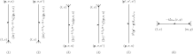
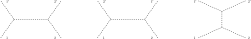
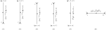

.. _sec_the_feynman_rules:

The Feynman Rules
-----------------

In :ref:`sec_cluster_decomposable_hamiltonians`, we've discussed the condition that the Hamiltonian must satisfy in order for the cluster decomposition principle to hold. Namely, the Hamiltonian can be written as a polynomial :eq:`eq_general_expansion_of_hamiltonian` of creation and annihilation operators in normal order, such that the coefficients contains exactly one momentum conversing delta function. In order to derive this condition, we've encountered the idea of Feynman diagrams, which is a bookkeeping device for the evaluation of S-matrix. We couldn't say more about the coefficients besides the delta function because we had not introduced the building blocks of the Hamiltonian, namely, the quantum fields. Now that we've seen how to construct even the most general fields in the previous chapter, we're ready to spell out the full details of Feynman diagrams, first in spacetime coordinates, and then in momentum space coordinates.

.. warning::

	We'll consider only fields of massive particles in this chapter.

.. _sec_spacetime_feynman_rules:

Spacetime Feynman rules
^^^^^^^^^^^^^^^^^^^^^^^

In this section, we'll derive the Feynman rules in spacetime coordinates, which will establish a diagrammatic framework for calculating S-matrices. In the next section, we'll translate these rules to the momentum space.

First, recall the S-matrix formulated in terms of the S-operator :eq:`eq_s_matrix_power_series_expansion_time_ordered_density` as follows

.. math::
	:label: eq_s_matrix_fully_expanded_by_timed_ordered_interaction_density

	S_{\pbf'_1, \sigma'_1, n'_1;~\pbf'_2, \sigma'_2, n'_2;~\cdots,~\pbf_1, \sigma_1, n_1;~\pbf_2, \sigma_2, n_2;~\cdots}
		&= \sum_{N=0}^{\infty} \frac{(-\ifrak)^N}{N!} \int d^4 x_1 d^4 x_2 \cdots d^4 x_n \\
		&\quad \times \Phi_{\VAC} \cdots a(\pbf'_2, \sigma'_2, n'_2) a(\pbf'_1, \sigma'_1, n'_2) \\
		&\quad \times T\left\{ \Hscr(x_1) \cdots \Hscr(x_N) \right\} \\
		&\quad \times a^{\dagger}(\pbf_1, \sigma_1, n_1) a^{\dagger}(\pbf_2, \sigma_2, n_2) \cdots \Phi_{\VAC}

where :math:`T\{ \cdots \}` is the time-ordered product defined by :eq:`eq_defn_time_ordered_product`. As we've seen from the previous chapter, the interaction density :math:`\Hscr(x)` may be written as a polynomial in fields and their adjoint as follows

.. math:: \Hscr(x) = \sum_{i} g_i \Hscr_i(x)
	:label: eq_interaction_density_as_sum_of_monomials

where :math:`\Hscr_i(x)` is monomial of certain fields and their adjoint. Finally, we recall the general formula :eq:`eq_general_field_psi_field` for a quantum field as follows

.. math::
	:label: eq_generic_field_expression

	\psi_{\ell}(x) = (2\pi)^{-3/2} \sum_{\sigma} \int d^3 p \left( e^{\ifrak p \cdot x} u_{\ell}(\pbf, \sigma, n) a(\pbf, \sigma, n) + e^{-\ifrak p \cdot x} v_{\ell}(\pbf, \sigma, n) a^{\dagger}(\pbf, \sigma, n^c) \right)

where we've restored the particle species index :math:`n`, and absorbed the sign :math:`(-1)^{2B}` in :eq:`eq_general_field_psi_field` into the :math:`v`-spinor. Unlike the notation used in :ref:`sec_quantum_lorentz_symmetry`, the sub-index :math:`\ell` here includes not only the running indexes of the Lorentz representation, but also the representation itself, as well as the particle species :math:`n`.

.. warning::

	Any specific field of interest, whether it's scalar, vector, or Dirac, must be first put into the form :eq:`eq_generic_field_expression` in order to use the Feynman rules, that we'll introduce below.

According to :eq:`eq_defn_annihilation_and_creation_field`, we can also write, with obvious modifications, :math:`\psi_{\ell}(x) = \psi^+_{\ell}(x) + \psi^-_{\ell}(x)` such as :math:`\psi^+_{\ell}(x)` is a linear combination of annihilation operators, and :math:`\psi^-_{\ell}(x)` is a linear combination of creation operators.

Now the idea of the Feynman rules to calculate the S-matrix is same as what has been discussed in :ref:`sec_cluster_decomposable_hamiltonians`. Namely, we'd like to move any annihilation operator to the right of a creation operator using the standard commutation rule :eq:`eq_creation_annihilation_commutator`. To be more specific, we'll list all the possible scenarios as follows

.. _listing_feynman_rules:

#. Paring a final particle (in out-state) :math:`(\pbf, \sigma, n)` with a field adjoint :math:`\psi^{\dagger}_{\ell}(x)` gives
	.. math::
		:label: eq_feynman_rule_a_psi_dagger

		\underbracket{a(\pbf, \sigma, n) \psi^{\dagger}_{\ell}(x)}
			\coloneqq \left[ a(\pbf, \sigma, n), \psi^{\dagger}_{\ell}(x) \right]_{\pm}
			= (2\pi)^{-3/2} e^{-\ifrak p \cdot x} u^{\ast}_{\ell}(\pbf, \sigma, n)

#. Paring a final antiparticle :math:`(\pbf, \sigma, n^c)` with a field :math:`\psi_{\ell}(x)` gives
	.. math::
		:label: eq_feynman_rule_a_psi

		\underbracket{a(\pbf, \sigma, n^c) \psi_{\ell}(x)}
			\coloneqq \left[ a(\pbf, \sigma, n^c), \psi_{\ell}(x) \right]_{\pm}
			= (2\pi)^{-3/2} e^{-\ifrak p \cdot x} v_{\ell}(\pbf, \sigma, n)

#. Paring a field :math:`\psi_{\ell}(x)` with an initial particle (in in-state) :math:`(\pbf, \sigma, n)` gives
	.. math::
		:label: eq_feynman_rule_psi_a_dagger

		\underbracket{\psi_{\ell}(x) a^{\dagger}(\pbf, \sigma, n)}
		\coloneqq \left[ \psi_{\ell}(x), a^{\dagger}(\pbf, \sigma, n) \right]_{\pm}
		= (2\pi)^{-3/2} e^{\ifrak p \cdot x} u_{\ell}(\pbf, \sigma, n)

#. Paring a field adjoint :math:`\psi^{\dagger}_{\ell}(x)` with an initial antiparticle :math:`(\pbf, \sigma, n^c)` gives
	.. math::
		:label: eq_feynman_rule_psi_dagger_a_dagger

		\underbracket{\psi^{\dagger}(x) a^{\dagger}(\pbf, \sigma, n^c)}
		\coloneqq \left[ \psi^{\dagger}(x), a^{\dagger}(\pbf, \sigma, n^c) \right]_{\pm}
		= (2\pi)^{-3/2} e^{\ifrak p \cdot x} v^{\ast}_{\ell}(\pbf, \sigma, n)

#. Paring a final particle :math:`(\pbf, \sigma, n)` (or antiparticle) with an initial particle :math:`(\pbf', \sigma', n')` (or antiparticle) gives
	.. math::
		:label: eq_feynman_rule_a_a_dagger

		\underbracket{a(\pbf', \sigma', n') a^{\dagger}(\pbf, \sigma, n)}
		\coloneqq \left[ a(\pbf', \sigma', n'), a^{\dagger}(\pbf, \sigma, n) \right]_{\pm}
		= \delta^3(\pbf' - \pbf) \delta_{\sigma' \sigma} \delta_{n' n}

#. Paring a field :math:`\psi_{\ell}(x)` in :math:`\Hscr_i(x)` with a field adjoint :math:`\psi_m^{\dagger}(y)` in :math:`\Hscr_j(y)` gives
	.. math::
		:label: eq_feynman_rule_propagator

		\underbracket{\psi_{\ell}(x) \psi^{\dagger}_m(y)}
			&\coloneqq \theta(x_0 - y_0) \left[ \psi^+_{\ell}(x), \psi^{+ \dagger}_m(y) \right]_{\pm} \mp \theta(y_0 - x_0) \left[ \psi^{- \dagger}_m(y), \psi^-_{\ell}(x) \right]_{\pm} \\
			&\eqqcolon -\ifrak \Delta_{\ell m}(x, y)

   where :math:`\theta(\tau)` is the step function which equals :math:`1` for :math:`\tau > 0` and vanishes for :math:`\tau < 0`. Here we remind ourselves once again that the Feynman rule is all about moving annihilation operators, e.g. :math:`\psi^+_{\ell}(x)` and :math:`\psi^{- \dagger}_m(y)`, to the right of creation operators, e.g. :math:`\psi^-_{\ell}(x)` and :math:`\psi^{- \dagger}_m(y)`. The sign :math:`\mp` in the middle is due to the fact that when the top sign should to be used, the particles are fermions, and hence the interchange of the fields due to time ordering requires an extra minus sign.

   This quantity is known as a *propagator*, which will be evaluated in the next section.

.. note::
	1. In the above listing, we've assumed that the item on the left in the (anti-)commutators also lies to the left of the item on the right in the (anti-)commutator in the vacuum expectation value in :eq:`eq_s_matrix_fully_expanded_by_timed_ordered_interaction_density` if we ignore the time ordering operator. The same applies to case (6) where :math:`\psi_{\ell}(x)` is assumed to lie to the left of :math:`\psi_m^{\dagger}(y)`. In particular, if we assume that the interaction density :math:`\Hscr(x)` is normally ordered in the sense that all the field adjoints lie to the left of the fields, then :math:`\Hscr_i(x)` necessarily lies to the left of :math:`\Hscr_j(y)`, and we don't have to to define :math:`\Delta_{\ell m}(x, x)` which would require certain regulation to not blow up integrals.
	2. The parings listed above are commonly known as `Wick contractions <https://en.wikipedia.org/wiki/Wick%27s_theorem>`__.

A great invention of Feynman is the following diagrammatic representation of the above rules, known as the Feynman diagrams.

.. _fig_spacetime_feynman_diagrams:

	All possible edges in Feynman diagrams.

A few comments are in order to clarify the meaning of these diagrams

* The arrow points towards the (positive) direction of time, which is upwards for particles and downwards for antiparticles. In other words, we interpret an antiparticle as a particle that moves backwards in time. An exceptional case is (6), where the edge is placed horizontally. The reason is that a field or its adjoint doesn't just create or destroy (anti-)particles -- they create/destroy a particle and at the same time destroy/create the corresponding antiparticle, respectively. In light of :eq:`eq_feynman_rule_propagator`, there is no reason to prefer either an upward or a downward arrow.
* The arrow in (6) points from :math:`(m, y)` to :math:`(\ell, x)` since :math:`\psi_{\ell}(x)` is a field and :math:`\psi^{\dagger}_m(y)` is a field adjoint. Two processes happen in this scenario, namely, a particle created by :math:`\psi^{+ \dagger}_m(y)` is absorbed by :math:`\psi^+_{\ell}(x)`, and an antiparticle created by :math:`\psi^-_{\ell}(x)` is absorbed by :math:`\psi^{- \dagger}_m(y)`. The arrow is compatible with both processes.
* In the case where the particle is its own antiparticle, the arrows in (1) -- (6) will be omitted because one cannot tell apart a field and a field adjoint according to :eq:`eq_general_field_charge_inversion_transformation`.
* We didn't draw the other scenario in (5) where an antiparticle is created and then destroyed without any interaction. In this case we need to flip the direction of the arrow.
* Every nodes in the diagram, marked by a fat dot, correspond to a monomial :math:`\Hscr_i(x)` in :eq:`eq_interaction_density_as_sum_of_monomials`. Moreover, for each node, there are as many incoming edges as there are fields, and as many outgoing edges as there are field adjoints.

With these basic building blocks at hand, we're ready to evaluate :eq:`eq_s_matrix_fully_expanded_by_timed_ordered_interaction_density` using Feynman diagrams. The first thing to notice is that the S-matrix, as defined by :eq:`eq_s_matrix_fully_expanded_by_timed_ordered_interaction_density`, should be viewed as a power series, where a term of order :math:`N` corresponds to a monomial given as a product of powers, each of which is :math:`N_i`-th power of an interaction type :math:`g_i \Hscr_i(x)` (see :eq:`eq_interaction_density_as_sum_of_monomials`), such that :math:`N = \sum_i N_i`.

To a given term of order :math:`N`, one can draw the associated Feynman diagrams in two steps as follows. The first step is to draw (on a piece of paper) one upward-pointing and downward-pointing strand for each in-state particle and antiparticle, respectively, at the bottom; do the same to the out-state particles and antiparticles at the top; and draw in the middle :math:`N_i` vertices for each interaction types :math:`i`, which corresponds to a monomial :math:`\Hscr_i(x)`, with incoming and outgoing edges corresponding to its fields and field adjoints, respectively. The second step is to connect any pair of open strands by an oriented edge if the particle in question is different from its antiparticle, and by an unoriented edge otherwise. Moreover, the vertices and the edges are labelled as illustrated in the figure above.

Now knowing how to draw a Feynman diagram of any given order for an interaction, we can spell out the recipe for a diagrammatic calculation of the S-matrix given by :eq:`eq_s_matrix_fully_expanded_by_timed_ordered_interaction_density` in the following steps.

1. Draw all (distinct) Feynman diagrams (in reality, to a finite order) following the rules described above. We'll come back to what we mean by "distinct" right after the recipe.
2. For each diagram, we assign a factor :math:`-\ifrak` to each vertex, corresponding to one factor of the power :math:`(-\ifrak)^n` in :eq:`eq_s_matrix_fully_expanded_by_timed_ordered_interaction_density`; and a factor :math:`g_i` to each vertex corresponding to the coefficient of :math:`\Hscr_i(x)` in :eq:`eq_interaction_density_as_sum_of_monomials`; and a factor in the :ref:`listing of Feynman rules <listing_feynman_rules>` to each edge. Multiplying all the factors together and integrating over all the coordinates :math:`x_1, x_2, \cdots`, one for each vertex, we obtain a (numeric) valuation of the Feynman diagram.
3. The S-matrix is the "sum" over all the evaluations of the Feynman diagrams. Here the sum is put in quotation marks because we might do subtraction instead of addition when there are fermionic fields involved in the interaction. More precisely, for each Feynman diagram, one can move the fields and field adjoints over each other that the two ends of every edge are next to each other (in the right order). Then we add a minus sign in front of the evaluation if such rearrangement involves an odd number of swaps between fermionic fields (or field adjoints).

These are really all one needs to evaluate S-matrices using Feynman diagrams, but a few further notes may be necessary to make it completely clear. Firstly, note that we've ignored the factor :math:`1 / N!` in :eq:`eq_s_matrix_fully_expanded_by_timed_ordered_interaction_density` from our recipe above. The reason lies in the word "distinct" from the first step. More precisely, we consider two Feynman diagrams, which differ by a re-labeling of the vertices, to be the same. Since there are :math:`N!` ways of labeling :math:`N` vertices, we have already taken the fraction :math:`1 / N!` into account by including only distinct diagrams.

Secondly, by the discussion in :ref:`sec_cluster_decomposable_hamiltonians`, only connected Feynman diagrams will be included so that the resulting S-matrix satisfies the cluster decomposition principle.

.. _paragraph_interaction_density_symmetry_factor:

The last note is more of a convention (for convenience), which aims at further remove duplications among Feynman diagrams. Here by duplication we mean diagrams that are not exactly the same but whose evaluations are the same. A basic example is when a monomial in the interaction density :math:`\Hscr(x)` contains a power of the same field (or field adjoint). From the viewpoint of Feynman diagrams, it means that a vertex may have more than one identical attached (incoming or outgoing) strands. Now when other strands want to connect to these identical ones, they may choose which one to connect first, and second, and so on, but the result will be the same regardless of the choices. Hence it's a convention to write the coefficient of :math:`\Hscr_i(x)` as :math:`g_i / k!` if it contains :math:`k` identical fields (or field adjoints), so that in a diagrammatic calculation, one only need to include one of such diagrams. Other numerical factors might be inserted in more complex situations, such as when two vertices with identical attached strands try to connect to each other, or when there is a loop of identical vertices. These cases are discussed in [Wei95]_ page 265 -- 267, and we'll come back to them when they become relevant in calculations.

To make things concrete and to prepare for the calculations in the next sections, we conclude the discussion of Feynman rules with two prototypical examples.

Example 1: :math:`\psi^{\dagger} \psi \phi`-interaction
+++++++++++++++++++++++++++++++++++++++++++++++++++++++

Consider the following interaction density

.. math::
	:label: eq_psi_dagger_psi_phi_interaction_density

	\Hscr(x) = \sum_{\ell m k} g_{\ell m k} \psi_{\ell}^{\dagger}(x) \psi_m(x) \phi_k(x)

where :math:`\psi(x)` is a (complex) fermionic field, and :math:`\phi(x)` is a real, i.e., :math:`\phi(x) = \phi^{\dagger}(x)`, bosonic field. This is an important type of interaction since it shows up not only in quantum electrodynamics, but in fact in the whole Standard Model of electromagnetic, weak, and strong interactions.

This type of interaction allows three kinds of scattering processes, namely, fermion-fermion, fermion-boson, and boson-boson scattering, which we'll discuss one by one.

.. _listing_fermion_fermion_scattering:

Fermion-fermion scattering
	The scattering is represented as :math:`12 \to 1'2'`, where all in- and out-state particles :math:`1, 2, 1', 2'` are fermions. Up to the second order, there are two (connected) Feynman diagrams

	.. figure:: ./static/psi-dagger-psi-phi-fermion-fermion-scattering.svg
		:align: center

		Two second-order fermion-fermion scattering diagrams :math:`\psi^{\dagger} \psi \phi`-theory.

	where the solid (directed) edges represent the fermions, and the dashed (undirected) edges represent the (neutral) boson. More explicitly, the two diagrams correspond to the following two contractions

	.. math::
		:label: eq_fermion_fermion_scattering_1212

		C_{121'2'} &\coloneqq \underbracket{ a(1') \psi_{\ell}^{\dagger}(x) }
		\underbracket{ a(2') \psi_{\ell'}^{\dagger}(y) }
		\underbracket{ \phi_k(x) \phi_{k'}(y) }
		\underbracket{ \psi_m(x) a^{\dagger}(1) }
		\underbracket{ \psi_{m'}(y) a^{\dagger}(2) } \\
		C_{122'1'} &\coloneqq \underbracket{ a(2') \psi_{\ell}^{\dagger}(x) }
		\underbracket{ a(1') \psi_{\ell'}^{\dagger}(y) }
		\underbracket{ \phi_k(x) \phi_{k'}(y) }
		\underbracket{ \psi_m(x) a^{\dagger}(1) }
		\underbracket{ \psi_{m'}(y) a^{\dagger}(2) }

	respectively. Moreover, comparing with the original order

	.. math::
		:label: eq_two_particles_scattering_original_order

		a(2') a(1') \psi^{\dagger}(x) \psi(x) \phi(x) \psi^{\dagger}(y) \psi(y) \phi(y) a^{\dagger}(1) a^{\dagger}(2)

	we see that the two contractions in :eq:`eq_fermion_fermion_scattering_1212` require an even and odd number of swaps between fermionic operators, respectively. We note that whether a given diagram requires an even or odd fermionic swaps is rather arbitrary, and depends on many conventions. However, the fact that the two diagrams corresponding to :eq:`eq_fermion_fermion_scattering_1212` carry opposite signs is independent of the conventions and hence meaningful. Indeed, it's another incarnation of the Fermi statistics in the sense that the S-matrix switches sign if either the in-state fermions :math:`1 \leftrightarrow 2` or the out-state fermions :math:`1' \leftrightarrow 2'` are swapped.

	Now let's use the Feynman rules :eq:`eq_feynman_rule_a_psi_dagger` -- :eq:`eq_feynman_rule_propagator` to evaluate the fermion-fermion scattering S-matrix up to second order as follows [#connected_s_matrix_by_feynman_diagrams]_

	.. math::

		S^C_{\pbf'_1 \sigma'_1 n'_1,~\pbf'_2 \sigma'_2 n'_2;~~\pbf_1 \sigma_1 n_1,~\pbf_2 \sigma_2 n_2}
			&= \sum_{\ell m k, \ell' m' k'} (-\ifrak)^2 g_{\ell m k} g_{\ell' m' k'} \int d^4 x d^4 y (C_{121'2'} - C_{122'1'}) \\
			&= (2\pi)^{-6} \sum_{\ell m k, \ell' m' k'} (-\ifrak)^2 g_{\ell m k} g_{\ell' m' k'} \int d^4 x d^4 y~(-\ifrak) \Delta_{k k'}(x, y) \\
			&\quad \times e^{\ifrak p_1 \cdot x + \ifrak p_2 \cdot y} u_m(\pbf_1, \sigma_1, n_1) u_{m'}(\pbf_2, \sigma_2, n_2) \\
			&\quad \times \Big( e^{-\ifrak p'_1 \cdot x - \ifrak p'_2 \cdot y} u^{\ast}_{\ell}(\pbf'_1, \sigma'_1, n'_1) u^{\ast}_{\ell'}(\pbf'_2, \sigma'_2, n'_2) \\
				&\qquad - e^{-\ifrak p'_2 \cdot x - \ifrak p'_1 \cdot y} u^{\ast}_{\ell}(\pbf'_2, \sigma'_2, n'_2) u^{\ast}_{\ell'}(\pbf'_1, \sigma'_1, n'_1) \Big)

.. _listing_fermion_boson_scattering:

Fermion-boson scattering
	Consider the scattering :math:`12 \to 1'2'`, where particles :math:`1, 1'` are fermions and :math:`2, 2'` are bosons, under interaction density :eq:`eq_psi_dagger_psi_phi_interaction_density`. Up to second order, there are again two Feynman diagrams as follows

	.. figure:: ./static/psi-dagger-psi-phi-fermion-boson-scattering.svg
		:align: center

		Two second-order fermion-boson scattering diagrams :math:`\psi^{\dagger} \psi \phi`-theory.

	They correspond to the following two contractions

	.. math::
		:label: eq_fermion_boson_scattering_1212

		C_{121'2'} \coloneqq \underbracket{ a(2') \phi_k(x) }
		\underbracket{ a(1') \psi^{\dagger}_{\ell}(x) }
		\underbracket{ \psi_m(x) \psi_{\ell'}^{\dagger}(y) }
		\underbracket{ \psi_{m'}(y) a^{\dagger}(1) }
		\underbracket{ \phi_{k'}(y) a^{\dagger}(2) }

	and

	.. math::
		:label: eq_fermion_boson_scattering_1221

		C_{122'1'} \coloneqq \underbracket{ a(2') \phi_{k'}(y) }
		\underbracket{ a(1') \psi_{\ell}^{\dagger}(x) }
		\underbracket{ \psi_m(x) \psi_{\ell'}^{\dagger}(y) }
		\underbracket{ \psi_{m'}(y) a^{\dagger}(1) }
		\underbracket{ \phi_k(x) a^{\dagger}(2) }

	respectively. Comparing with the ordering of operators :eq:`eq_two_particles_scattering_original_order`, we see that neither :eq:`eq_fermion_boson_scattering_1212` nor :eq:`eq_fermion_boson_scattering_1221` require any fermionic swap, and hence no extra signs are need in this case, in contrast to the previous case of fermion-fermion scattering.

	Next let's use :eq:`eq_feynman_rule_a_psi_dagger` -- :eq:`eq_feynman_rule_propagator` to evaluate the second order S-matrix as follows

	.. math::

		S^C_{\pbf'_1 \sigma'_1 n'_1,~\pbf'_2 \sigma'_2 n'_2;~\pbf_1 \sigma_1 n_1,~\pbf_2 \sigma_2 n_2}
			&= \sum_{\ell m k, \ell' m' k'} (-\ifrak)^2 g_{\ell m k} g_{\ell' m' k'} \int d^4 x d^4 y (C_{121'2'} - C_{122'1'}) \\
			&= (2\pi)^{-6} \sum_{\ell m k, \ell' m' k'} (-\ifrak)^2 g_{\ell m k} g_{\ell' m' k'} \int d^4 x d^4 y~(-\ifrak) \Delta_{m \ell'}(x, y) \\
			&\quad \times e^{-\ifrak p'_1 \cdot x + \ifrak p_1 \cdot y} u^{\ast}_{\ell}(\pbf'_1, \sigma'_1, n'_1) u_{m'}(\pbf_1, \sigma_1, n_1) \\
			&\quad \times \Big( e^{-\ifrak p'_2 \cdot x + \ifrak p_2 \cdot y} u^{\ast}_k(\pbf'_2, \sigma'_2, n'_2) u_{k'}(\pbf_2, \sigma_2, n_2) \\
				&\qquad + e^{-\ifrak p'_2 \cdot y + \ifrak p_2 \cdot x} u^{\ast}_{k'}(\pbf'_2, \sigma'_2, n'_2) u_k(\pbf_2, \sigma_2, n_2) \Big)

.. _listing_boson_boson_scattering:

Boson-boson scattering
	It turns out that the lowest order boson-boson scattering under the interaction density :eq:`eq_psi_dagger_psi_phi_interaction_density` is four. An example of such scattering is given by the following Feynman diagram

	.. figure:: ./static/psi-dagger-psi-phi-boson-boson-scattering.svg
		:align: center

		The fourth order boson-boson scattering diagram in :math:`\psi^{\dagger} \psi \phi`-theory.

	which involves a fermionic loop. We'll not evaluate the corresponding S-matrix here, but note that the corresponding (fermionic) contraction

	.. math::

		\underbracket{ \psi(x_1) \psi^{\dagger}(x_2) }
		\underbracket{ \psi(x_2) \psi^{\dagger}(x_3) }
		\underbracket{ \psi(x_3) \psi^{\dagger}(x_4) }
		\underbracket{ \psi(x_4) \psi^{\dagger}(x_1) }

	where we've ignored the terms involving the bosonic operators, requires an odd number of fermionic swaps, which, in turn, requires an extra minus sign. This is a general phenomenon for any diagram that involves a fermionic loop.

Example 2: :math:`\phi^3`-interaction
+++++++++++++++++++++++++++++++++++++

Now let's consider an interaction density that involves a power of the same field as follows

.. math::
	:label: eq_phi3_interaction_density

	\Hscr(x) = \frac{1}{3!} \sum_{\ell m k} g_{\ell m k} \phi_{\ell}(x) \phi_m(x) \phi_k(x)

where :math:`g_{\ell m k}` is totally symmetric, and the extra factor :math:`1/3!` is to :ref:`account for this symmetry <paragraph_interaction_density_symmetry_factor>`.

We'll evaluate the scattering amplitude of two (identical) bosons :math:`12 \to 1'2'`. In this case, there are three connected Feynman diagrams of second order as follows

	Three second-order boson-boson scattering diagrams in :math:`\phi^3`-theory.

They correspond to the following three contractions

.. math::

	C_{121'2'} &\coloneqq \underbracket{ a(2') \phi_{\ell}(x) }
		\underbracket{ a(1') \phi_{\ell'}(y) }
		\underbracket{ \phi_m(x) \phi_{m'}(y) }
		\underbracket{ \phi_{k'}(y) a^{\dagger}(1) }
		\underbracket{ \phi_k(x) a^{\dagger}(2) }\\
	C_{122'1'} &\coloneqq \underbracket{ a(2') \phi_{\ell'}(y) }
		\underbracket{ a(1') \phi_{\ell}(x) }
		\underbracket{ \phi_m(x) \phi_{m'}(y) }
		\underbracket{ \phi_{k'}(y) a^{\dagger}(1) }
		\underbracket{ \phi_k(x) a^{\dagger}(2) } \\
	C'_{121'2'} &\coloneqq \underbracket{ a(2') \phi_{\ell}(x) }
		\underbracket{ a(1') \phi_k (x)}
		\underbracket{ \phi_m(x) \phi_{m'}(y) }
		\underbracket{ \phi_{k'}(y) a^{\dagger}(1) }
		\underbracket{ \phi_{\ell'}(y) a^{\dagger}(2) }

respectively. We note once again that the factor :math:`1/3!` in :eq:`eq_phi3_interaction_density` allows us to include just the above three contractions, and ignore the other ones obtained by, say, permuting :math:`\ell, m`, and :math:`k` (or equivalently :math:`\ell', m'`, and :math:`k'`). With this in mind, we can now calculate the (connected) S-matrix using :eq:`eq_feynman_rule_a_psi_dagger` -- :eq:`eq_feynman_rule_propagator` as follows

.. math::

	& S^C_{\pbf'_1 \sigma'_1 n'_1,~\pbf'_2 \sigma'_2 n'_2;~\pbf_1 \sigma_1 n_1,~\pbf_2 \sigma_2 n_2} \\
		&\quad = \sum_{\ell m k, \ell' m' k'} (-\ifrak)^2 g_{\ell m k} g_{\ell' m' k'} \int d^4 x d^4 y (C_{121'2'} + C_{122'1'} + C'_{121'2'}) \\
		&\quad = (2\pi)^{-6} \sum_{\ell m k, \ell' m' k'} (-\ifrak)^2 g_{\ell m k} g_{\ell' m' k'} \int d^4 x d^4 y (-\ifrak) \Delta_{m m'}(x, y) \\
		&\qquad \times \Big( e^{\ifrak \left( p_2 - p'_2 \right) \cdot x + \ifrak \left( p_1 - p'_1 \right) \cdot y} u^{\ast}_{\ell}(\pbf'_2, \sigma'_2, n'_2) u^{\ast}_{\ell'}(\pbf'_1, \sigma'_1, n'_1) u_{k'}(\pbf_1, \sigma_1, n_1) u_k(\pbf_2, \sigma_2, n_2) \\
		&\quad\qquad + e^{\ifrak (p_2 - p'_1) \cdot x + \ifrak (p_1 - p'_2) \cdot y} u^{\ast}_{\ell'}(\pbf'_2, \sigma'_2, n'_2) u^{\ast}_{\ell}(\pbf'_1, \sigma'_1, n'_1) u_{k'}(\pbf_1, \sigma_1, n_1) u_k(\pbf_2, \sigma_2, n_2) \\
		&\quad\qquad + e^{-\ifrak (p'_1 + p'_2) \cdot x + \ifrak (p_1 + p_2) \cdot y} u^{\ast}_{\ell}(\pbf'_2, \sigma'_2, n'_2) u^{\ast}_k(\pbf'_1, \sigma'_1, n'_1) u_{k'}(\pbf_1, \sigma_1, n_1) u_{\ell'}(\pbf_2, \sigma_2, n_2) \Big)

A special case is when :math:`\phi` is a scalar field so that :eq:`eq_phi3_interaction_density` takes the following form

.. math:: \Hscr(x) = \frac{g}{3!} \phi^3(x)

In this case, the S-matrix can be simplified as follows

.. math::

	S^C_{\pbf'_1,~\pbf'_2;~\pbf_1,~\pbf_2} &= \frac{\ifrak g^2}{(2\pi)^6 \sqrt{16 E'_1 E'_2 E_1 E_2}} \int d^4 x d^4 y~\Delta_F(x, y) \\
		&\quad \times \left( e^{\ifrak \left( p_2 - p'_2 \right) \cdot x + \ifrak \left( p_1 - p'_1 \right) \cdot y}
		+ e^{\ifrak (p_2 - p'_1) \cdot x + \ifrak (p_1 - p'_2) \cdot y}
		+ e^{-\ifrak (p'_1 + p'_2) \cdot x + \ifrak (p_1 + p_2) \cdot y} \right)

where :math:`\Delta_F` is the so-called `Feynman propagator <https://en.wikipedia.org/wiki/Propagator#Feynman_propagator>`__ and will be discussed in detail in the next section.

Momentum space Feynman rules
^^^^^^^^^^^^^^^^^^^^^^^^^^^^

There turns out to be many advantages in working in the :math:`4`-momentum space, instead of the spacetime. Hence the goal of this section is to translate the Feynman rules :eq:`eq_feynman_rule_a_psi_dagger` -- :eq:`eq_feynman_rule_propagator` to the momentum space. The biggest challenge, however, lies in the fact that so far we've been working exclusively under the assumption that the :math:`4`-momentum lies on the mass shell, whether in the spinors appearing in :eq:`eq_feynman_rule_a_psi_dagger` -- :eq:`eq_feynman_rule_psi_a_dagger` or in the propagator :eq:`eq_feynman_rule_propagator`. We'll tackle this challenge in three steps. First, we'll rewrite the propagator as an integral on the momentum space, as opposed to the integral :eq:`eq_defn_Delta_plus` defined on the mass shell. This will then allow us to translate the Feynman rules to the momentum space, except for the external edges which still live on the mass shell because the in- and out-state particles do so. Finally, we'll discuss how to generalize the Feynman rules so that the "external lines" do not necessarily have to live on the mass shell.

.. _sec_propagator_in_momentum_space:

Propagator in momentum space
++++++++++++++++++++++++++++

Plugging :eq:`eq_generic_field_expression` into :eq:`eq_feynman_rule_propagator`, we can rewrite the propagator in terms of the spin sums as follows

.. math::
	:label: eq_propagator_as_spin_sums

	-\ifrak \Delta_{\ell m}(x, y) &= \theta(x_0 - y_0) (2\pi)^{-3} \int d^3 p~e^{\ifrak p \cdot (x-y)} \sum_{\sigma} u_{\ell}(\pbf, \sigma, n) u^{\ast}_m(\pbf, \sigma, n) \\
		&\qquad \pm \theta(y_0 - x_0) (2\pi)^{-3} \int d^3 p~e^{\ifrak p \cdot (y-x)} \sum_{\sigma} v^{\ast}_m(\pbf, \sigma, n) v_{\ell}(\pbf, \sigma, n)

where the top and bottom signs apply to bosonic and fermionic fields, respectively.

Then, in light of :eq:`eq_general_field_spin_sums_as_pi` and :eq:`eq_general_field_spin_sum_is_polynomial`, we can write the spin sums as polynomials in (on-mass-shell) :math:`4`-momenta as follows

.. math::
	:label: eq_spin_sum_u_and_v_as_polynomial

	\sum_{\sigma} u_{\ell}(\pbf, \sigma, n) u^{\ast}_m(\pbf, \sigma, n) &= \left( 2\sqrt{\pbf^2 + M_n^2} \right)^{-1} P_{\ell m} \left( \sqrt{\pbf^2 + M_n^2}, \pbf \right) \\
	\sum_{\sigma} v_{\ell}(\pbf, \sigma, n) v^{\ast}_m(\pbf, \sigma, n) &= \pm \left( 2\sqrt{\pbf^2 + M_n^2} \right)^{-1} P_{\ell m} \left( -\sqrt{\pbf^2 + M_n^2}, -\pbf \right)

where the top and bottom signs correspond to bosonic and fermionic fields, respectively. Note that although according to :eq:`eq_general_field_spin_sums_as_pi`, the spin sums for :math:`u` and :math:`v` can be made the same (with respect to some basis of representation), we've introduced here an additional sign for :math:`v` using the symmetry property :eq:`eq_general_field_spin_sum_polynomial_parity`. In particular, as we'll see right below, this extra sign is also needed to be consistent with our previous calculations for Dirac fields.

Before we continue evaluating the propagator, let's take a moment to figure out how :math:`P_{\ell m}(p)` looks like in the cases of scalar, vector, Dirac, and general :math:`(A, B)` fields. The case of scalar fields is the simplest, and it follows from :eq:`eq_scalar_u_and_v` that

.. math:: P^{\text{scalar}}(p) = 1
	:label: eq_p_polynomial_scalar

Next, for spin-:math:`1` vector fields, it follows from :eq:`eq_vector_field_Pi_matrix` and :eq:`eq_vector_field_defn_Pi` that

.. math:: P^{\text{vector}}_{\mu \nu}(p) = \eta_{\mu \nu} + p_{\mu} p_{\nu} / M^2
	:label: eq_p_polynomial_vector

which is even in :math:`p`, and hence consistent with :eq:`eq_spin_sum_u_and_v_as_polynomial`.

Then for spin-:math:`1/2` Dirac fields, it follows from :eq:`eq_dirac_field_n_and_m_matrix_as_spinor_sum` and :eq:`eq_dirac_field_spin_sum_finite_momentum` that

.. math:: P^{\text{Dirac}}_{\ell m}(p) = \big( (-\ifrak p^{\mu} \gamma_{\mu} + M) \beta \big)_{\ell m}
	:label: eq_p_polynomial_dirac

Finally, for any :math:`(A, B)` field, the polynomial :math:`P_{ab, a'b'}(p) = \pi_{ab, a'b'}(p)` (on the mass shell) is given by :eq:`eq_general_field_spin_sum`. We note that :eq:`eq_spin_sum_u_and_v_as_polynomial` is consistent with :eq:`eq_general_field_spin_sums_as_pi` due to the parity symmetry :eq:`eq_general_field_spin_sum_polynomial_parity`, which we only proved in a special case.

Back to the evaluation of the propagator :eq:`eq_propagator_as_spin_sums`. By plugging :eq:`eq_spin_sum_u_and_v_as_polynomial` into :eq:`eq_propagator_as_spin_sums`, we can further rewrite the propagator as follows

.. math::
	:label: eq_propagator_as_delta_plus

	-\ifrak \Delta_{\ell m}(x, y) = \theta(x_0 - y_0) P_{\ell m}(-\ifrak \p_x) \Delta_+(x-y) + \theta(y_0 - x_0) P_{\ell m}(-\ifrak \p_x) \Delta_+(y-x)

where :math:`\Delta_+(x)` is defined by :eq:`eq_defn_Delta_plus`, and :math:`P_{\ell m}(p)` takes the form of :eq:`eq_general_field_spin_sum_as_polynomial` and is linear in :math:`p_0 = \sqrt{\pbf^2 + M^2}`. In particular, we see that :math:`\Delta_{\ell m}(x, y)` is really a function of :math:`x - y`, and henceforth can be written as

.. math:: \Delta_{\ell m}(x - y) = \Delta_{\ell m}(x, y)

Now we must remember that although :math:`P_{\ell m}(p)` for scalar, vector, and Dirac fields, look like a polynomial defined generally on the momentum space, they're really only defined on the mass shell, as shown in :eq:`eq_general_field_spin_sum_as_polynomial` for general fields. We'll first try the poor man's extension of :math:`P_{\ell m}(p)` to a genuine momentum space polynomial by the following definition

.. math:: P_{\ell m}^{(L)}(p) \coloneqq P_{\ell m}^{(0)}(\pbf) + p_0 P_{\ell m}^{(1)}(\pbf)

where :math:`P_{\ell m}^{(0)}, P_{\ell m}^{(1)}` correspond to :math:`P_{ab, a'b'}, 2Q_{ab, a'b'}` in :eq:`eq_general_field_spin_sum_as_polynomial`, respectively. Clearly :math:`P^{(L)}(p) = P(p)` when :math:`p` is on the mass shell, or equivalently :math:`p_0 = \sqrt{\pbf^2 + M^2}`. Here the supscript :math:`L` stands for linear, since :math:`P^{(L)}(p)` is linear in :math:`p_0`. This linearity, as we'll now demonstrate, turns out to be the key feature of this rather naive extension.

Since the step function :math:`\theta(\tau)`, which equals :math:`1` for :math:`\tau > 0` and vanishes for :math:`\tau < 0`, has the following property

.. math:: \p_{x_0} \theta(x_0 - y_0) = -\p_{x_0} \theta(y_0 - x_0) = \delta(x_0 - y_0)

we can rewrite :eq:`eq_propagator_as_delta_plus` as follows

.. math::

	-\ifrak \Delta_{\ell m}(x - y) &= P^{(L)}_{\ell m}(-\ifrak \p_x) \left( \theta(x_0-y_0) \Delta_+(x-y) + \theta(y_0-x_0) \Delta_+(y-x) \right) \\
		&\qquad - \big( \ifrak \p_{x_0} \theta(x_0-y_0) \big) P^{(1)}_{\ell m}(-\ifrak \p_x) \Delta_+(x-y) \\
		&\qquad - \big( \ifrak \p_{x_0} \theta(y_0-x_0) \big) P^{(1)}_{\ell m}(-\ifrak \p_x) \Delta_+(y-x) \\
		&= P^{(L)}_{\ell m}(-\ifrak \p_x) \big( \theta(x_0-y_0) \Delta_+(x-y) + \theta(y_0-x_0) \Delta_+(y-x) \big) \\
		&\qquad - \blue{\ifrak  \delta(x_0-y_0) P^{(1)}_{\ell m}(-\ifrak \nabla) \left( \Delta_+(x-y) - \Delta_+(y-x) \right)} \\
		&= P^{(L)}_{\ell m}(-\ifrak \p_x) \big( \theta(x_0-y_0) \Delta_+(x-y) + \theta(y_0-x_0) \Delta_+(y-x) \big)

where the blue terms vanish since :math:`\Delta_+(x)` is even if :math:`x_0 = 0`.

Define the *Feynman propagator* :math:`\Delta_F(x)` by

.. math:: -\ifrak \Delta_F(x) \coloneqq \theta(x_0) \Delta_+(x) + \theta(-x_0) \Delta_+(-x)
	:label: eq_defn_feynman_propagator

which, by the way, is also the propagator for scalar fields. Then the general propagator can be derived from it as follows

.. math:: \Delta_{\ell m}(x-y) = P^{(L)}_{\ell m}(-\ifrak \p_x) \Delta_F(x-y)
	:label: eq_general_propagator_from_feynman_propagator

Now we'll evaluate :eq:`eq_defn_feynman_propagator` as an integral over the momentum space. The key trick is to express the step function :math:`\theta(t)` as follows

.. math:: \theta(t) = \frac{-1}{2\pi\ifrak} \int_{-\infty}^{\infty} ds~\frac{e^{-\ifrak st}}{s + \ifrak \epsilon}
	:label: eq_theta_step_function_as_contour_integral

where :math:`\epsilon > 0` is infinitesimally small. The fact that :math:`\theta(t)` vanishes for :math:`t < 0` and equals :math:`1` for :math:`t > 0` can be easily verified using the `residue theorem <https://en.wikipedia.org/wiki/Residue_theorem>`__. Plugging :eq:`eq_theta_step_function_as_contour_integral` and :eq:`eq_defn_Delta_plus` into :eq:`eq_defn_feynman_propagator`, we can calculate as follows

.. math::

	\begin{align*}
		& -\ifrak \Delta_F(x) \\
			&~ = \frac{-1}{\ifrak (2\pi)^4} \int d^3 q ds~\frac
				{\exp(-\ifrak (s + \sqrt{\qbf^2 + M^2}) x_0 + \ifrak \qbf \cdot \xbf) + \exp(\ifrak (s + \sqrt{\qbf^2 + M^2}) x_0 - \ifrak \qbf \cdot \xbf)}
				{2(s + \ifrak \epsilon) \sqrt{\qbf^2 + M^2}} \\
			&~ \xlongequal{\substack{p_0 = s + \sqrt{\qbf^2 + M^2} \\ \pbf = \qbf}} \frac{-1}{\ifrak (2\pi)^4} \int d^4 p~\frac
				{\exp(\ifrak p \cdot x) + \exp(-\ifrak p \cdot x)}
				{2\left( p_0 - \sqrt{\pbf^2 + M^2} + \ifrak \epsilon \right) \sqrt{\pbf^2 + M^2}} \\
			&~ = \frac{-1}{\ifrak (2\pi)^4} \int d^4 p~\frac{\exp(\ifrak p \cdot x)}{2\sqrt{\pbf^2 + M^2}} \left( \frac{1}
				{p_0 - \sqrt{\pbf^2 + M^2} + \ifrak \epsilon} - \frac{1}{p_0 + \sqrt{\pbf^2 + M^2} - \ifrak \epsilon} \right) \\
			&~ = \frac{1}{\ifrak (2\pi)^4} \int d^4 p~\frac{\exp(\ifrak p \cdot x)}{p^2 + M^2 - \ifrak \epsilon}
	\end{align*}

where in the last equality we've replaced :math:`2\sqrt{\pbf^2 + M^2} \epsilon` with :math:`\epsilon`, and ignored the :math:`\epsilon^2` term. It follows that

.. math:: \Delta_F(x) = (2\pi)^{-4} \int d^4 p~\frac{\exp(\ifrak p \cdot x)}{p^2 + M^2 - \ifrak \epsilon}
	:label: eq_feynman_propagator_as_momentum_space_integral

.. dropdown:: Green's function for the Klein-Gordon equation
	:animate: fade-in-slide-down

	The Feynman propagator :math:`\Delta_F(x)` defined by :eq:`eq_feynman_propagator_as_momentum_space_integral` turns out to be also a Green's function for the Klein-Gordon equation is the sense that

	.. math:: \left( \square - M^2 \right) \Delta_F(x) = -\delta^4(x)
		:label: eq_klein_gordon_greens_function

	Indeed, it follows readily from the following formal expansion of the (one-dimensional) Dirac delta function

	.. math:: \delta(x) = \frac{1}{2\pi} \int dy~e^{\pm \ifrak xy}

	Although the factor :math:`-\ifrak \epsilon` in the denominator in :eq:`eq_feynman_propagator_as_momentum_space_integral` plays no role in the defining equation :eq:`eq_klein_gordon_greens_function` of the Green's function, it does determine the boundary condition of the Green's function in the follow sense

	.. math::

		\Delta_F(x) &\to \frac{\ifrak}{(2\pi)^3} \int \frac{d^3 p}{2\sqrt{\pbf^2 + M^2}}~\exp\left( -\ifrak x_0 \sqrt{\pbf^2 + M^2} + \ifrak \pbf \cdot \xbf \right) \quad \text{as}~~x_0 \to +\infty \\
		\Delta_F(x) &\to \frac{\ifrak}{(2\pi)^3} \int \frac{d^3 p}{2\sqrt{\pbf^2 + M^2}}~\exp\left(+\ifrak x_0 \sqrt{\pbf^2 + M^2} - \ifrak \pbf \cdot \xbf \right) \quad \text{as}~~x_0 \to -\infty

	This can be seen either directly from :eq:`eq_defn_feynman_propagator` or by factoring the denominator :math:`p^2 + M^2 = \left( \sqrt{\pbf^2+M^2} - p_0 \right)\left( \sqrt{\pbf^2+M^2} + p_0 \right)` and using the residue theorem.

Plugging :eq:`eq_feynman_propagator_as_momentum_space_integral` into :eq:`eq_general_propagator_from_feynman_propagator`, we can express the propagator as an integral over the entire momentum space (without the mass-shell constraint) as follows

.. math::
	:label: eq_propagator_as_momentum_space_integral_linear

	\Delta_{\ell m}(x, y) = \Delta_{\ell m}(x-y) = (2\pi)^{-4} \int d^4 p~\frac{P^{(L)}_{\ell m}(p) e^{\ifrak p \cdot (x-y)}}{p^2 + M^2 - \ifrak \epsilon}

This expression is, however, not Lorentz covariant in general since :math:`P^{(L)}_{\ell m}(p)`, being linear in :math:`p_0`, is not. More precisely, we'd like :math:`P_{\ell m}(p)` to satisfy the following

.. math:: P_{\ell m}(\Lambda p) = D_{\ell \ell'}(\Lambda) D^{\ast}_{m m'}(\Lambda) P_{\ell' m'}(p)

where we recall the :math:`m` index correspond to a field adjoint according to :eq:`eq_feynman_rule_propagator`. Nonetheless, we see from :eq:`eq_p_polynomial_scalar` -- :eq:`eq_p_polynomial_dirac` that the polynomial :math:`P` is Lorentz covariant in the case of scalar, vector, and Dirac fields. Among these three cases, the only case where :math:`P` is not linear in :math:`p_0` is vector field. Indeed, we have the following from :eq:`eq_p_polynomial_vector`

.. math::

	P^{(L)}_{\mu \nu}(p)
		&= \eta_{\mu \nu} + M^{-2} \left( p_{\mu}p_{\nu} + \delta_{\mu}^0 \delta_{\nu}^0 \left( -p_0^2 + \pbf^2 + M^2 \right) \right) \\
		&= P_{\mu \nu}(p) + M^{-2} (p^2 + M^2) \delta_{\mu}^0 \delta_{\nu}^0

Plugging into :eq:`eq_propagator_as_momentum_space_integral_linear`, we have

.. math::
	:label: eq_vector_field_propagator_needs_local_term

	\Delta^{\text{vector}}_{\mu \nu}(x, y) = (2\pi)^{-4} \int d^4 p~\frac{P_{\mu \nu}(p) e^{\ifrak p \cdot (x-y)}}{p^2 + M^2 - \ifrak \epsilon} + \blue{M^{-2}\delta^4(x-y) \delta_{\mu}^0 \delta_{\nu}^0}

We see that the price to pay for making :math:`P_{\mu \nu}(p)` Lorentz covariant is the blue term, which is local in the sense that it's non-vanishing only when :math:`x = y`.

.. todo::
	It's claimed in [Wei95]_ page 278 -- 279 that such an extra non-covariant term may be countered by a modification to the interaction density, but I have had a hard time seeing why that's the case. In order to not get stuck at this point, we'll ignore the difference between :math:`P^{(L)}` and :math:`P` at momentum so that :eq:`eq_propagator_as_momentum_space_integral_linear` and write

	.. math:: \Delta_{\ell m}(x, y) = (2\pi)^{-4} \int d^4 p~\frac{P_{\ell m}(p) e^{\ifrak p \cdot (x-y)}}{p^2 + M^2 - \ifrak \epsilon}
		:label: eq_propagator_as_momentum_space_integral

	and remember to be extra careful when, in a concrete case, :math:`P` is not linear in :math:`p_0`.

.. _sec_feynman_rules_in_momentum_space:

Feynman rules in momentum space
+++++++++++++++++++++++++++++++

To turn the Feynman rules derived in :ref:`sec_spacetime_feynman_rules`, specifically :eq:`eq_feynman_rule_a_psi_dagger` -- :eq:`eq_feynman_rule_propagator`, from an integral over spacetime coordinates as in :eq:`eq_s_matrix_fully_expanded_by_timed_ordered_interaction_density` to an integral over the momentum space coordinates, we need to integrate out the :math:`x` coordinates. Indeed, as can be seen from :eq:`eq_feynman_rule_a_psi_dagger` -- :eq:`eq_feynman_rule_psi_dagger_a_dagger`, as well as :eq:`eq_propagator_as_momentum_space_integral`, the :math:`x` variables appear only in the exponential terms. More precisely, at each vertex, the only term that involves :math:`x` is the following

.. math::

	\exp\left( \sum \ifrak x \cdot p_{\text{in}} - \sum \ifrak x \cdot p_{\text{out}} + \sum \ifrak x \cdot p_{\text{entering}} - \sum \ifrak x \cdot p_{\text{leaving}} \right)

where :math:`p_{\text{in}}` and :math:`p_{\text{out}}` denote the momenta of the in- and out-state (anti-)particles that connect the vertex, respectively, if there is any, and :math:`p_{\text{entering}}` and :math:`p_{\text{leaving}}` denote the momenta on the internal edges that entering and leaving the vertex, respectively. Integrating :math:`x` out, we get the following momentum-conservation factor

.. math:: (2\pi)^4 \delta^4 \left( \sum p_{\text{in}} - \sum p_{\text{out}} + \sum p_{\text{entering}} - \sum p_{\text{leaving}} \right)

assigned to each vertex.

Now with all the :math:`x` coordinates integrated out, we can reformulate the :ref:`diagrammatic Feynman rules <fig_spacetime_feynman_diagrams>` as follows

.. _fig_momentum_space_feynman_diagrams:

	Figure. Feynman rules in momentum space.

To evaluate the (connected) S-matrix of the form :eq:`eq_s_matrix_fully_expanded_by_timed_ordered_interaction_density`, we follow the steps explained in :ref:`sec_spacetime_feynman_rules` with one modification:

  	Associate to each vertex a factor :math:`-\ifrak (2\pi)^4 \delta^4 \left( \sum p_{\text{in}} - \sum p_{\text{out}} + \sum p_{\text{entering}} - \sum p_{\text{leaving}} \right)`, and to each edge a factor as indicated in the figure above.

Indeed, the momentum-conservation delta functions at the vertices correspond precisely to the delta functions appeared in :ref:`sec_cluster_decomposable_hamiltonians`. Hence the same argument implies, once again, that the connected S-matrix contains exactly one momentum-conservation delta function.

Before moving onto the discussion about the external edges, let's revisit the example calculations of S-matrices in :math:`\psi^{\dagger} \psi \phi`-interaction in momentum space as follows.

:ref:`Fermion-boson scattering <listing_fermion_boson_scattering>` in momentum space
	The goal is to re-evaluate the (connected) S-matrix :math:`S^C_{1'2',12}`, where :math:`1` stands for the fermion, and :math:`2` stands for the boson, in momentum space. Using the momentum space Feynman rules, together with obvious abbreviations, the calculation goes as follows.

	.. math::

			S^C_{1'2',12}
				&= \sum_{\ell m k, \ell' m' k'} (-\ifrak)^{2+1} (2\pi)^{8-6-4} g_{\ell m k} g_{\ell' m' k'} \int d^4 p~\frac{P_{m \ell'}(p)}{p^2 + M^2 - \ifrak \epsilon} u_{m'}(1) u^{\ast}_{\ell}(1') \\
				&\qquad \times \Big( u_{k'}(2) u^{\ast}_k(2') \delta^4(p-p_1-p_2) \delta^4(p'_1+p'_2-p) \\
				&\qquad\qquad + u_k(2) u^{\ast}_{k'}(2') \delta^4(p+p'_2-p_1) \delta^4(p'_1-p_2-p) \Big) \\
				&= \ifrak (2\pi)^{-2} \delta^4(p'_1+p'_2-p_1-p_2) \sum_{\ell m k, \ell' m' k'} g_{\ell m k} g_{\ell' m' k'} u_{m'}(1) u^{\ast}_{\ell}(1') \\
				&\qquad \times \left( \frac{P_{m \ell'}(p_1+p_2)}{(p_1+p_2)^2+M^2-\ifrak \epsilon} u_{k'}(2) u^{\ast}_k(2') + \frac{P_{m \ell'}(p_1-p'_2)}{(p_1-p'_2)^2+M^2-\ifrak \epsilon} u_k(2) u^{\ast}_{k'}(2') \right) \\
				&= \ifrak (2\pi)^{-2} \delta^4(p'_1+p'_2-p_1-p_2) \\
				&\qquad \times \sum_{k, k'} \Bigg( \left( \blue{u^{\dagger}(1') \Gamma_k \frac{P(p_1+p_2)}{(p_1+p_2)^2+M^2-\ifrak \epsilon} \Gamma_{k'} u(1)} \right) u_{k'}(2) u^{\ast}_k(2') \\
				&\qquad\qquad + \left( \blue{u^{\dagger}(1') \Gamma_k \frac{P(p_1-p'_2)}{(p_1-p'_2)^2+M^2-\ifrak \epsilon} \Gamma_{k'} u(1)} \right) u_k(2) u^{\ast}_{k'}(2') \Bigg)

	where the blue terms are supposed to be understood as matrix multiplications with

	.. math:: (\Gamma_k)_{\ell m} \coloneqq g_{\ell m k}

	and :math:`u^{\dagger}` as a transpose-conjugated row vector, and :math:`M` is the mass of the intermediate fermion.

	One can see from the calculation above that a general S-matrix can readily be read off from the Feynman diagrams, and is made up of the following pieces

	1. An appropriate power of :math:`\ifrak` and :math:`\pi` determined by the number of edges and vertices.

	2. A momentum-conservation delta function equating the total in- and out-state particles.

	3. A summation of (matrix) products of field coefficients, propagator integrands, and coupling constants, one for each Feynman diagram. In particular, the momentum carried by a propagator is determined by the momentum-conservation law at each vertex.

:ref:`Fermion-fermion scattering <listing_fermion_fermion_scattering>` in momentum space
	Using the observation we made from the previous calculation, we can immediately write down the S-matrix :math:`S^C_{1'2',12}`, where both :math:`1` and :math:`2` are fermions, as follows

	.. math::

		S^C_{1'2',12} &= \ifrak (2\pi)^{-2} \delta^4(p'_1+p'_2-p_1-p_2) \\
			&\qquad \times \sum_{k, k'} \bigg( \frac{P_{k k'}(p'_1 - p_1)}{(p'_1-p_1)^2 + M^2 - \ifrak\epsilon} \left( u^{\dagger}(1) \Gamma_k u(1') \right) \left( u^{\dagger}(2) \Gamma_{k'} u(2') \right) \\
			&\qquad\qquad - \frac{P_{k k'}(p'_2-p_1)}{(p'_2-p_1)^2 + M^2 - \ifrak\epsilon} \left( u^{\dagger}(1) \Gamma_k u(2') \right) \left( u^{\dagger}(2) \Gamma_{k'} u(1') \right) \bigg)

:ref:`Boson-boson scattering <listing_boson_boson_scattering>` in momentum space
	We didn't actually calculate the (4th order) boson-boson scattering S-matrix :math:`S^C_{1'2',12}` in spacetime coordinates due to its complexity. But it becomes much simpler in momentum space coordinates, and can be calculated as follows. First, let's figure out the powers of :math:`\ifrak` and :math:`\pi`, respectively. Since there are :math:`4` vertices and :math:`4` internal edges, each of which contribute one :math:`-\ifrak`, we get a contribution of :math:`(-\ifrak)^8 = 1`. Moreover, since there are equal numbers of vertices and internal edges, each of which contribute :math:`(2\pi)^4` and :math:`(2\pi)^{-4}`, respectively, and :math:`4` external edges, each of which contribute :math:`(2\pi)^{-3/2}`, we get a total contribution of :math:`(2\pi)^{-6}`. Remembering an additional minus sign coming from the fermionic loop, we have the following

	.. math::

		S^C_{1'2',12} &= -(2\pi)^{-6} \delta^4(p'_1+p'_2-p_1-p_2) \sum_{k_1, k_2, k'_1, k'_2} u^{\ast}_{k'_1}(1') u^{\ast}_{k'_2}(2') u_{k_1}(1) u_{k_2}(2) \\
			&\qquad \times \int d^4 p~\op{Tr} \bigg( \frac{P(p)}{p^2+M^2-\ifrak\epsilon} \Gamma_{k'_1} \frac{P(p-p'_1)}{(p-p'_1)^2+M^2-\ifrak\epsilon}
				\Gamma_{k'_2} \\
			&\qquad \times \frac{P(p-p'_1-p'_2)}{(p-p'_1-p'_2)^2+M^2-\ifrak\epsilon} \Gamma_{k_2} \frac{P(p-p'_1-p'_2+p_2)}{(p-p'_1-p'_2+p_2)^2+M^2-\ifrak\epsilon} \Gamma_{k_1} \bigg) + \cdots

	where :math:`\cdots` denotes valuations of other (4th order) Feynman diagrams.

External edges off the mass shell
+++++++++++++++++++++++++++++++++

By transforming propagators into integrals over the :math:`4`-momentum space as in :eq:`eq_propagator_as_momentum_space_integral`, and integrating out the spacetime coordinates, we've been able to express the S-matrix as an integral over a product of :math:`4`-momentum space coordinates, one for each internal edge that doesn't split the Feynman diagram into disconnected components. In particular, as we've seen in several examples from the previous section, the S-matrix involves no momentum space integrals at all when the Feynman diagram is a tree.

However, the external edges are still confined to the mass shell since the in- and out-state particles are. We'd like to relax such confinement to remove any mass-shell constraints. It will allow us to calculate contributions from a large Feynman diagram in terms of its smaller local pieces, and facilitate the derivation of the path integral formalism later. The idea of a "local" Feynman diagram, i.e., a diagram without external edges, is to add additional "vertices at infinity" at the places of in- and out-state particles, which turn the external edges into internal ones. Moreover, unlike the (internal) vertices, whose spacetime coordinates will be integrated as in :eq:`eq_s_matrix_fully_expanded_by_timed_ordered_interaction_density`, the spacetime coordinates of the added vertices will be kept intact. In particular, no momentum conservation law will be imposed on these vertices.

It turns out that this procedure can be generalized to a field theory with external interaction, in which case the interaction-picture perturbation term takes the following form

.. math:: V_{\epsilon}(t) = V(t) + \sum_a \int d^3 x~\epsilon_a(t, \xbf) o_a(t, \xbf)

Here :math:`\epsilon_a(t, \xbf)` are the infinitesimal parameters, and :math:`o_a(t, \xbf)` are the external currents in the interaction picture in the following sense

.. math:: o_a(t) = \exp(\ifrak H_0 t) o_a(0) \exp(-\ifrak H_0 t)

in analogy to :eq:`eq_defn_interaction_perturbation_term`.

Now under the perturbation :math:`V_{\epsilon}(t)`, the S-matrix, whose entry :math:`S_{\beta\alpha}` is a complex number, becomes a functional :math:`S_{\beta\alpha}[\epsilon]` in complex functions :math:`\epsilon_a`. The functional derivative

.. math:: \left. \frac{\delta^r S_{\beta\alpha}[\epsilon]}{\delta\epsilon_a(x) \delta\epsilon_b(y) \cdots} \right|_{\epsilon=0}
	:label: eq_functional_derivative_of_s_matrix

can be evaluated using the usual Feynman rules. Indeed, besides the internal vertices coming from the interaction density :math:`\Hscr(t, \xbf)`, we must also include external vertices coming from :math:`o(t, \xbf)`. For example, if :math:`o(t, \xbf)` are monomials of fields and field adjoints, then there will be :math:`r` external vertices, each of which has as many incoming and outgoing edges as there are fields and field adjoints in the corresponding :math:`o(t, \xbf)`, respectively. In particular, if :math:`o(t, \xbf)` are all degree one, then we recover the off-mass-shell Feynman diagrams, as promised.

.. dropdown:: Gell-Mann and Low's Theorem
	:icon: unlock
	:animate: fade-in-slide-down

	It's turns out that :eq:`eq_functional_derivative_of_s_matrix` may be evaluated to an amplitude as follows

	.. math::
		:label: eq_gell_mann_low_theorem

		\left. \frac{\delta^r S_{\beta\alpha}[\epsilon]}{\delta\epsilon_{a_1}(x_1) \cdots \delta\epsilon_{a_r}(x_r)} \right|_{\epsilon=0}
			= (-\ifrak)^r \left( \Psi_{\beta}^+, T\left\{ O_{a_1}(x_1) \cdots O_{a_r}(x_r) \right\} \Psi_{\alpha}^- \right)

	where

	.. math:: O_a(t, \xbf) = \exp(\ifrak H t) o_a(0, \xbf) \exp(-\ifrak H t) = \Omega(t) o_a(t, \xbf) \Omega^{-1}(t)
		:label: eq_heisenberg_picture_external_field

	using the definition :eq:`eq_defn_of_Omega` represent the Heisenberg picture operators, and :math:`\Psi_{\alpha}^-, \Psi_{\beta}^+` are the in- and out-states, respectively.

	The formula :eq:`eq_gell_mann_low_theorem` is know as `Gell-Mann and Low's theorem <https://en.wikipedia.org/wiki/Gell-Mann_and_Low_theorem>`_. To see this, let's write out the functional derivative, following :eq:`eq_s_matrix_power_series_expansion_time_ordered`, as follows

	.. math::

		& \left. \frac{\delta^r S_{\beta\alpha[\epsilon]}}{\delta\epsilon_{a_1}(x_1) \cdots \delta\epsilon_{a_r}(x_r)} \right|_{\epsilon=0} \\
			&\qquad = \sum_{N=0}^{\infty} \frac{(-\ifrak)^{N+r}}{N!} \int_{-\infty}^{\infty} d\tau_1 \cdots d\tau_N
				\left( \Phi_{\beta}, T\left\{ V(\tau_1) \cdots V(\tau_N) o_{a_1}(x_1) \cdots o_{a_r}(x_r) \right\} \Phi_{\alpha} \right)

	where we note that each external vertex corresponding to some :math:`o_a(x)` comes with a factor :math:`-\ifrak`, but the spacetime coordinates :math:`x` are not integrated. Assume without loss of generality that :math:`x_1, \cdots, x_r` are already time-ordered in the sense that

	.. math:: (x_1)_0 \geq (x_2)_0 \geq \cdots \geq (x_r)_0
		:label: eq_gell_mann_low_external_fields_are_time_ordered

	Then we can expand the time-ordered product above as follows

	.. math::

		& \left. \frac{\delta^r S_{\beta\alpha[\epsilon]}}{\delta\epsilon_{a_1}(x_1) \cdots \delta\epsilon_{a_r}(x_r)} \right|_{\epsilon=0} \\
			&\qquad = \sum_{N=0}^{\infty} \frac{(-\ifrak)^{N+r}}{N!} \sum_{N_0 + \cdots N_r = N} \frac{N!}{N_0! \cdots N_r!} \\
			&\qquad\qquad \times \int_{(x_1)_0}^{\infty} d\tau_{01} \cdots d\tau_{0N_0} \int_{(x_2)_0}^{(x_1)_0} d\tau_{11} \cdots d\tau_{1N1} \cdots \int_{-\infty}^{(x_r)_0} d\tau_{r1} \cdots d\tau_{rN_r} \\
			&\qquad\qquad \times \Big( \Phi_{\beta}, T\left\{ V(\tau_{01}) \cdots V(\tau_{0N_0}) \right\} o_{a_1}(x_1) T\left\{ V(\tau_{11}) \cdots V(\tau_{1N_1}) \right\} o_{a_2}(x_2) \cdots \\
			&\qquad\qquad\qquad \times \cdots o_{a_r}(x_r) T\left\{ V(\tau_{r1}) \cdots V(\tau_{rN_r}) \right\} \Phi_{\alpha} \Big)

	where :math:`\tau_{01}, \cdots, \tau_{0N0}` are greater than :math:`(x_1)_0`, and :math:`\tau_{11}, \cdots, \tau_{1N_1}` are between :math:`(x_2)_0` and :math:`(x_1)_0`, and so on. In other words, we're summing over a partition of :math:`\tau_1, \cdots, \tau_N` into :math:`r+1` unordered groups, separated by :math:`(x_1)_0, \cdots, (x_r)_0`. The combinatorial coefficient :math:`N! / (N_0! \cdots N_r!)` counts exactly the number of such partitions.

	It follows that

	.. math::

		\left. \frac{\delta^r S_{\beta\alpha[\epsilon]}}{\delta\epsilon_{a_1}(x_1) \cdots \delta\epsilon_{a_r}(x_r)} \right|_{\epsilon=0}
			&= (-\ifrak)^r \big( \Phi_{\beta}, U(\infty, (x_1)_0) o_{a_1}(x_1) U((x_1)_0, (x_2)_0) o_{a_2}(x_2) \cdots \\
			&\qquad \times o_{a_r}(x_r) U((x_r)_0, -\infty) \Phi_{\alpha} \big)

	where, according to :eq:`eq_s_matrix_power_series_expansion_time_ordered` and :eq:`eq_s_operator_by_u`,

	.. math::

		U(\tau', \tau) = \sum_{N=0}^{\infty} \frac{(-\ifrak)^N}{N!} \int_{\tau}^{\tau'} d\tau_1 \cdots d\tau_N T\left\{ V(\tau_1) \cdots V(\tau_N) \right\}
			= \Omega^{-1}(\tau') \Omega(\tau)

	Combining with :eq:`eq_heisenberg_picture_external_field` and :eq:`eq_defn_of_Omega`, we conclude that

	.. math::

		\left. \frac{\delta^r S_{\beta\alpha[\epsilon]}}{\delta\epsilon_{a_1}(x_1) \cdots \delta\epsilon_{a_r}(x_r)} \right|_{\epsilon=0}
			&= (-\ifrak)^r \left( \Omega(\infty)\Phi_{\beta}, O_{a_1}(x_1) \cdots O_{a_r}(x_r) \Omega(-\infty)\Phi_{\alpha} \right) \\
			&= (-\ifrak)^r \left( \Psi_{\beta}^+, O_{a_1}(x_1) \cdots O_{a_r}(x_r) \Psi_{\alpha}^- \right)

	under the assumption :eq:`eq_gell_mann_low_external_fields_are_time_ordered`. Finally the Gell-Mann and Low theorem :eq:`eq_gell_mann_low_theorem` follows from the symmetry property that both sides are symmetric under swaps of bosonic (external) fields and anti-symmetric under swaps of fermionic (external) fields.

.. rubric:: Footnotes

.. [#connected_s_matrix_by_feynman_diagrams] It's stated in [Wei95]_ page 271 and afterwards that it's the full S-matrices that are calculated. However, it seems that only the connected part of the S-matrices are calculated.