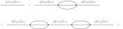

Non-Perturbative Methods
========================

TBD

Symmetry
--------

In this section, we'll revisit various symmetry principles encountered in perturbation theory from a non-perturbative perspective.

Translational symmetry
^^^^^^^^^^^^^^^^^^^^^^

The translational symmetry generates the :math:`4`-momentum operator :math:`P_{\mu}`. According to :eq:`eq_momenta_act_as_spatial_derivative` we have

.. math:: \left[P_{\mu}, O(x)\right] = \ifrak \frac{\p}{\p x^{\mu}} O(x)

for any operator :math:`O(x)` that doesn't explicitly involve spacetime coordinates. If the in- and out-states are also taken to have definite momenta in the following sense

.. math:: P^{\mu} \Psi_{\alpha}^- = p_{\alpha}^{\mu} \Psi_{\alpha}^-, \qquad P^{\mu} \Psi_{\beta}^+ = p_{\beta}^{\mu} \Psi_{\beta}^+

then the time-ordered product amplitude considered in Gell-Mann and Low's theorem :eq:`eq_gell_mann_low_theorem` satisfies the following differential equation

.. math::
    :label: eq_npm_translation_diff_eq

    &(p_{\beta\mu} - p_{\alpha\mu})\left(\Psi_{\beta}^+, T\{O_a(x_1), O_b(x_2), \cdots\} \Psi_{\alpha}^-\right) \\
        &\qquad= \left(\Psi_{\beta}^+, \left[P_{\mu}, T\{O_a(x_1), O_b(x_2), \cdots\}\right] \Psi_{\alpha}^-\right) \\
        &\qquad= \ifrak \left(\frac{\p}{\p x_1^{\mu}} + \frac{\p}{\p x_2^{\mu}} + \cdots\right) \left(\Psi_{\beta}^+, T\{O_a(x_1), O_b(x_2), \cdots\} \Psi_{\alpha}^-\right)

The general solution to the equation is given as follows

.. math::
    :label: eq_npm_timed_order_amplitude

    \left(\Psi_{\beta}^+, T\{O_a(x_1), O_b(x_2), \cdots\} \Psi_{\alpha}^-\right)
        = e^{\ifrak(p_{\alpha}-p_{\beta}) \cdot x} F_{ab\cdots}(x_1-x_2, x_1-x_3, \cdots)

where :math:`x = c_1x_1 + c_2x_2 + \cdots` as long as :math:`c_1 + c_2 + \cdots = 1`. Moreover :math:`F_{ab\cdots}` can be any function that depends only on the coordinate differences. It turns out that this is enough to deduce the overall conservation of momentum in the following sense

.. math::
    :label: eq_npm_4_momentum_conservation

    &\int d^4x_1~d^4x_2\cdots \left(\Psi_{\beta}^+, T\{O_a(x_1), O_b(x_2), \cdots\} \Psi_{\alpha}^-\right) \exp(-\ifrak k_1 \cdot x_1 - \ifrak k_2 \cdot x_2 - \cdots)  \\
        &\qquad\propto \delta^4(p_{\alpha} - p_{\beta} - k_1 - k_2 - \cdots)

To see this, let's consider a special case where :math:`x=x_1` in :eq:`eq_npm_timed_order_amplitude`. In this case, the power in the exponential in :eq:`eq_npm_4_momentum_conservation` can be rewritten as follows

.. math::

    -\ifrak k_1 \cdot x_1 - \ifrak k_2 \cdot x_2 - \cdots = -\ifrak\left(k_1 + k_2 + \cdots\right) \cdot x_1 - \ifrak k_2 \cdot (x_2 - x_1) - \cdots

Then the delta function in :eq:`eq_npm_4_momentum_conservation` comes out as the integral over :math:`x_1`.

The conservation of momentum of obvious from perturbation theory since the momentum is conserved at every vertex of every contributing Feynman diagram.

Internal symmetry
^^^^^^^^^^^^^^^^^

Recall from :eq:`eq_charge_of_annihilation_and_creation_operator` that if :math:`O_a(x)` is a field or some operator that either annihilates a charge :math:`q_a` or creates a charge :math:`-q_a`, then

.. math:: \left[Q, O_a(x)\right] = -q_a O_a(x)

Now if the in- and out-states :math:`\Psi_{\alpha}^-` and :math:`\Psi_{\beta}^+` have definite charges :math:`q_{\alpha}` and :math:`q_{\beta}`, respectively, then the charge is conserved in a process that involves fields/operators like :math:`O_a(x)` in the following sense

.. math::

    &(q_{\beta}-q_{\alpha}) \left(\Psi_{\beta}^+, T\{O_a(x_1), O_b(x_2), \cdots\}\Psi_{\alpha}^-\right) \\
        &\qquad = \left(\Psi_{\beta}^+, \left[Q, T\{O_a(x_1), O_b(x_2), \cdots\}\right] \Psi_{\alpha}^-\right) \\
        &\qquad = -(q_a + q_b + \cdots) \left(\Psi_{\beta}^+, T\{O_a(x_1), O_b(x_2), \cdots\} \Psi_{\alpha}^-\right)

which implies

.. math:: q_{\beta} = q_{\alpha} - q_a - q_b - \cdots

Charge conjugation
^^^^^^^^^^^^^^^^^^

We'll consider the spin-:math:`1/2` particle, whose charge conjugation formula is given by :eq:`eq_dirac_field_charge_conjugation`. Recall from :eq:`eq_dirac_field_bilinear_form_transform_under_spatial_inversion_and_charge_conjugation` that the vector :math:`\bar{\psi} \gamma^{\mu} \psi` transforms as follows

.. math::

    U(\Ccal) \left(\bar{\psi} \gamma^{\mu} \psi\right) U^{-1}(\Ccal) = -\bar{\psi} \gamma^{\mu} \psi

Given the Lagrangian :eq:`eq_qed_lagrangian_density` for QED, the charge conjugation is to be conserved if, in addition,

.. math:: U(\Ccal) a^{\mu} U^{-1}(\Ccal) = -a^{\mu}

for free photon field :math:`a^{\mu}`. The same transformation laws hold also in the Heisenberg picture. It follows, in particular, that the vacuum expectation value of the time-ordered product of an odd number of electromagnetic fields/currents vanishes. That is, the sum of Feynman diagrams with odd number of external lines, all of which are photonic, whether on or off mass-shell, vanishes.

This result is known as `Furry's theorem <https://en.wikipedia.org/wiki/Furry%27s_theorem>`__. To see why it holds in perturbation theory, note that each diagram with an odd number of external photon lines (and no other external lines), can be countered by another diagram whose electron lines are all reverted, by applying the charge conjugation.

Polology
--------

This is a made-up a word to describe the study of the structure and distribution of poles in amplitudes. To keep the discussion on a general ground, consider the following momentum-space vacuum expectation value

.. math::
    :label: eq_polology_defn_g

    G(q_1, q_2, \cdots, q_n) \coloneqq \int d^4x_1 \cdots d^4x_n~e^{-\ifrak q_1 \cdot x_1} \cdots e^{-\ifrak q_n \cdot x_n} \braket{T\{A_1(x_1) \cdots A_n(x_n)\}}_{\VAC}

Here the :math:`A`\s are Heisenberg-picture operators of arbitrary Lorentz type.

So far the only constraint on the off-mass-shell :math:`4`-momenta :math:`q_1, q_2, \cdots, q_n` is that they sum up to zero according to total momentum conservation. We're going to impose a further constraint that :math:`G` is a function of :math:`q^2` where

.. math:: q \coloneqq q_1 + \cdots + q_r = -q_{r+1} - \cdots - q_n
    :label: eq_polology_defn_q

In other words, the first :math:`r` momenta combined together is constrained to the mass shell. Then we'll argue that :math:`G` has a pole at :math:`q^2 = -m^2`, where :math:`m` is the mass of any one-particle state that has non-vanishing matrix elements with the states :math:`A_1^{\dagger} \cdots A_r^{\dagger} \Psi_{\VAC}` and :math:`A_{r+1} \cdots A_n \Psi_{\VAC}`. Moreover the residue at the pole is given by

.. math::
    :label: eq_vacuum_expectation_pole_formula

    G \to \frac{-2\ifrak\sqrt{\qbf^2 + m^2}}{q^2 + m^2 - \ifrak\epsilon} (2\pi)^7 \delta^4(q_1 + \cdots + q_n) \sum_{\sigma} M_{0 | \qbf, \sigma}(q_2, \cdots, q_r) M_{\qbf, \sigma | 0}(q_{r+2}, \cdots, q_n)

where the :math:`M`\s are defined by

.. math::
    :label: eq_polology_defn_m

    &\int d^4x_1 \cdots d^4x_r~e^{-\ifrak q_1 \cdot x_1} \cdots e^{-\ifrak q_r \cdot x_r} \left(\Psi_{\VAC}, T\{A_1(x_1), \cdots, A_r(x_r)\} \Psi_{\pbf, \sigma}\right) \\
        &\qquad = (2\pi)^4 \delta^4(q_1 + \cdots + q_r - p) M_{0 | \pbf, \sigma}(q_2, \cdots, q_r) \\
    &\int d^4x_{r+1} \cdots d^4x_n~e^{-\ifrak q_{r+1} \cdot x_{r+1}} \cdots e^{-\ifrak q_n \cdot x_n} \left(\Psi_{\pbf, \sigma}, T\{A_{r+1}(x_{r+1}), \cdots, A_n(x_n)\} \Psi_{\VAC}\right) \\
        &\qquad = (2\pi)^4 \delta^4(q_{r+1} + \cdots + q_n + p) M_{\pbf, \sigma | 0}(q_{r+2}, \cdots, q_n)

Before diving into the proof, it's instructive to rewrite :eq:`eq_vacuum_expectation_pole_formula` in a way closer to a Feynman diagram evaluation as follows

.. math::

    &G(q_1, \cdots, q_n) \to \sum_{\sigma} \int d^4k \\
        &\qquad \times \left((2\pi)^4 \delta^4(q_1 + \cdots + q_r - k) (2\pi)^{3/2} \left(2\sqrt{\kbf^2 + m^2}\right)^{1/2} M_{0 | \kbf, \sigma}(q_2, \cdots, q_r)\right) \\
        &\qquad \times \frac{-\ifrak}{(2\pi)^4} \frac{1}{k^2 + m^2 - \ifrak\epsilon} \\
        &\qquad \times \left((2\pi)^4 \delta^4(q_{r+1} + \cdots + q_n + k) (2\pi)^{3/2} \left(2\sqrt{\kbf^2 + m^2}\right)^{1/2} M_{0 | \kbf, \sigma}(q_{r+1}, \cdots, q_n)\right)

This can be thought of as the evaluation of a Feynman diagram with one internal line carrying a particle of mass :math:`m` connecting the first :math:`r` and the last :math:`n-r` external lines. The upshot here is that the particle carried by the internal line may *not* necessarily present in the Lagrangian, nor does it have to be "elementary", i.e., it may be a bound state of elementary particles.

Now to the proof. Let's first single out the term of interest from :eq:`eq_polology_defn_g` as follows

.. math::

    G(q_1, \cdots, q_n) &= \int d^4x_1 \cdots d^4x_n~e^{-\ifrak q_1 \cdot x_1} \cdots e^{-\ifrak q_n \cdot x_n} \\
        &\quad \times \theta\left(\min\left(x_1^0, \cdots, x_r^0\right) - \max\left(x_{r+1}^0, \cdots, x_n^0\right)\right) \\
        &\quad \times \left(\Psi_{\VAC}, T\{A_1(x_1), \cdots, A_r(x_r)\} T\{A_{r+1}(x_{r+1}), \cdots, A_n(x_n)\} \Psi_{\VAC}\right) + \cdots

where :math:`\theta` is the usual step function (cf. :eq:`eq_defn_time_ordered_product`) and the terms corresponding to other time-ordering are omitted.

The next step is to insert a complete set of basis corresponding to the particle of interest

.. math::

    &G(q_1, \cdots, q_n) = \int d^4x_1 \cdots d^4x_n~e^{-\ifrak q_1 \cdot x_1} \cdots e^{-\ifrak q_n \cdot x_n} \\
        &\qquad \times \theta\left(\min\left(x_1^0, \cdots, x_r^0\right) - \max\left(x_{r+1}^0, \cdots, x_n^0\right)\right) \\
        &\qquad \sum_{\sigma} \int d^3p \left(\Psi_{\VAC}, T\{A_1(x_1), \cdots, A_r(x_r)\} \Psi_{\pbf, \sigma}\right)
            \left(\Psi_{\pbf, \sigma}, T\{A_{r+1}(x_{r+1}), \cdots, A_n(x_n)\} \Psi_{\VAC}\right) \\
        &\qquad + \cdots

Using the translational symmetry (cf. :eq:`eq_npm_translation_diff_eq`), we can make the following change of variables

.. math::

    x_i &= x_1 + y_i, &\qquad i &= 2, 3, \cdots, r \\
    x_i &= x_{r+1} + y_i, &\qquad i &= r+2, \cdots, n

and evaluate

.. math::

    &\left(\Psi_{\VAC}, T\{A_1(x_1), \cdots, A_r(x_r)\} \Psi_{\pbf, \sigma}\right) \\
        &\qquad= e^{\ifrak p \cdot x_1} \left(\Psi_{\VAC}, T\{A_1(0), A_2(y_2), \cdots, A_r(y_r)\} \Psi_{\pbf, \sigma}\right) \\
    &\left(\Psi_{\pbf, \sigma}, T\{A_{r+1}(x_{r+1}), \cdots, A_n(x_n)\} \Psi_{\VAC}\right) \\
        &\qquad= e^{-\ifrak p \cdot x_{r+1}} \left(\Psi_{\pbf, \sigma}, T\{A_{r+1}(0), A_{r+2}(y_{r+2}), \cdots, A_n(x_n)\} \Psi_{\VAC}\right)

Moreover, the argument of the :math:`\theta` function can be rewritten as follows

.. math::

    &\min(x_1^0, \cdots, x_r^0) - \max(x_{r+1}^0, \cdots, x_n^0) \\
        &\qquad= x_1^0 - x_{r+1}^0 + \min(0, y_2^0, \cdots, y_r^0) - \max(0, y_{r+2}^0, \cdots, y_n^0)

and recall the Fourier representation of the :math:`\theta` function itself

.. math::

    \theta(\tau) = -\frac{1}{2\pi\ifrak} \int_{-\infty}^{\infty} \frac{e^{-\ifrak \omega \tau}}{\omega + \ifrak \epsilon} d\omega

Now let's re-evaluate :math:`G(q_1, \cdots, q_n)` as follows

.. math::

    &G(q_1, \cdots, q_n) = -\frac{1}{2\pi\ifrak} \int d^4x_1~d^4y_2 \cdots d^4y_r~d^4x_{r+1}~d^4y_{r+2} \cdots d^4y_n \\
        &\qquad \times e^{-\ifrak q_2 \cdot y_2} \cdots e^{-\ifrak q_r \cdot y_r} e^{-\ifrak q_{r+2} \cdot y_{r+2}} \cdots e^{-\ifrak q_n \cdot y_n} \\
        &\qquad \times \exp(-\ifrak (q_1 + \cdots + q_r) \cdot x_1) \exp(-\ifrak (q_{r+1} + \cdots + q_n) \cdot x_{r+1}) \\
        &\qquad \times \int_{-\infty}^{\infty} \frac{d\omega}{\omega + \ifrak\epsilon} \exp\left(-\ifrak\omega\left(x_1^0 - x_{r+1}^0 + \min(0, y_2^0, \cdots, y_r^0) - \max(0, y_{r+2}^0, \cdots, y_n^0)\right)\right) \\
        &\qquad \times \sum_{\sigma} \int d^3p~\exp\left(\ifrak p \cdot x_1 - \ifrak p \cdot x_{r+1}\right) \left(\Psi_{\VAC}, T\{A_1(0), A_2(y_2), \cdots, A_r(y_r)\} \Psi_{\pbf, \sigma}\right) \\
            &\qquad\qquad \times \left(\Psi_{\pbf, \sigma}, T\{A_{r+1}(0), A_{r+2}(y_{r+2}), \cdots, A_n(y_n)\} \Psi_{\VAC}\right) + \cdots \\
        &\quad= -\frac{1}{2\pi\ifrak} \int d^4y_2 \cdots d^4y_r~d^4y_{r+2} \cdots d^4y_n~e^{-\ifrak q_2 \cdot y_2} \cdots e^{-\ifrak q_r \cdot y_r} e^{-\ifrak q_{r+2} \cdot y_{r+2}} \cdots e^{-\ifrak q_n \cdot y_n} \\
        &\qquad \times \int_{-\infty}^{\infty} \frac{d\omega}{\omega + \ifrak\epsilon} \exp\left(\blue{-\ifrak\omega\left(\min(0, y_2^0, \cdots, y_r^0) - \max(0, y_{r+2}^0, \cdots, y_n^0)\right)}\right) \\
        &\qquad \times \sum_{\sigma} \int d^3p \left(\Psi_{\VAC}, T\{A_1(0), A_2(y_2), \cdots, A_r(y_r)\} \Psi_{\pbf, \sigma}\right) \\
            &\qquad\qquad \times \left(\Psi_{\pbf, \sigma}, T\{A_{r+1}(0), A_{r+2}(y_{r+2}), \cdots, A_n(y_n)\} \Psi_{\VAC}\right) \\
        &\qquad \times (2\pi)^4 \delta^3(\pbf - \qbf_1 - \cdots - \qbf_r) \delta\left(\sqrt{\pbf^2 + m^2} + \omega - q_1^0 - \cdots - q_r^0\right) \\
        &\qquad \times (2\pi)^4 \delta^3(\pbf + \qbf_{r+1} + \cdots + \qbf_n) \delta\left(\sqrt{\pbf^2 + m^2} + \omega + q_{r+1}^0 + \cdots + q_n^0\right) + \cdots

where the omitted terms in :math:`\cdots` are those arising from other time ordering.

Finally since we're interested in the pole at :math:`\omega = 0`, we may set the blue term to zero and evaluate the integral in :math:`\omega` and :math:`p` to arrive at the following pole structure

.. math::

    G(q_1, \cdots, q_n) &\to \ifrak (2\pi)^7 \delta^4(q_1 + \cdots + q_n) \left(q^0 - \sqrt{\qbf^2 + m^2} + \ifrak\epsilon\right)^{-1} \\
        &\qquad \times \sum_{\sigma} M_{0 | \qbf, \sigma}(q_2, \cdots, q_r) M_{\qbf, \sigma | 0}(q_{r+2}, \cdots, q_n)

where

.. math::
    :label: eq_polology_q_and_m_computation

    q &\coloneqq q_1 + \cdots + q_r = -q_{r+1} - \cdots - q_n \\
    M_{0 | \qbf, \sigma}(q_2, \cdots, q_r) &\coloneqq \int d^4y_2 \cdots d^4y_r~e^{-\ifrak q_2 \cdot y_2} \cdots e^{-\ifrak q_r \cdot y_r} \\
        &\qquad \times \left(\Psi_{\VAC}, T\{A_1(0), A_2(y_2), \cdots, A_r(y_r)\} \Psi_{\qbf, \sigma}\right) \\
    M_{\qbf, \sigma | 0}(q_{r+2}, \cdots, q_n) &\coloneqq \int d^4y_{r+2} \cdots d^4y_n~e^{-\ifrak q_{r+2} \cdot y_{r+2}} \cdots e^{-\ifrak q_n \cdot y_n} \\
        &\qquad \times \left(\Psi_{\qbf, \sigma}, T\{A_{r+1}(0), A_{r+2}(y_{r+2}), \cdots, A_n(y_n)\} \Psi_{\VAC}\right)

is consistent with :eq:`eq_polology_defn_q` and :eq:`eq_polology_defn_m`. This finishes the proof of :eq:`eq_vacuum_expectation_pole_formula` with the understanding that

.. math::

    \frac{1}{q^0 - \sqrt{\qbf^2 + m^2} + \ifrak\epsilon}
        = \frac{-q^0 - \sqrt{\qbf^2 + m^2} + \ifrak\epsilon}{-(q^0)^2 + \left(\sqrt{\qbf^2 + m^2} - \ifrak\epsilon\right)^2}
        = \frac{-2\sqrt{\qbf^2 + m^2}}{q^2 + m^2 - \ifrak\epsilon}

near the pole.

Field and Mass Renormalization
------------------------------

We'll apply the pole analysis developed in the previous section to the special case where a single external line approaches the mass shell. This analysis will lead us to the notion of renormalized masses and fields, which had traditionally been thought of as a trick to handle infinities in quantum field theories.

More precisely, let's consider a special case of :eq:`eq_polology_defn_g` as follows

.. math::
    :label: eq_renormalization_defn_g

    G_{\ell}(q_1, q_2, \cdots) = \int d^4x_1~d^4x_2 \cdots e^{-\ifrak q_1 \cdot x_1} e^{-\ifrak q_2 \cdot x_2} \cdots \braket{T\{\Oscr_{\ell}(x_1), A_2(x_2), \cdots\}}_{\VAC}

where :math:`\Oscr_{\ell}(x)` is a Heisenberg-picture operator with the same Lorentz transformation property as a free field :math:`\psi_{\ell}(x)` discussed in :ref:`sec_quantum_fields_and_antiparticles` (cf. :eq:`eq_defn_annihilation_and_creation_field`), while the rest :math:`A_2, A_3, \cdots` are arbitrary operators as in :eq:`eq_polology_defn_g`.

Now suppose there is a one-particle state :math:`\Psi_{\qbf_1, \sigma}` with non-vanishing matrix elements with :math:`\Oscr_{\ell}^{\dagger} \Psi_{\VAC}` and :math:`A_2 A_3 \cdots \Psi_{\VAC}`. It follows from :eq:`eq_vacuum_expectation_pole_formula` and :eq:`eq_polology_q_and_m_computation` that :math:`G_{\ell}` admits a pole at :math:`q_1^2 = -m^2` with the following residue

.. math::
    :label: eq_renormalization_defn_pole_original

    G_{\ell} &\to \frac{-2\ifrak\sqrt{\qbf_1^2 + m^2}}{q_1^2 + m^2 - \ifrak\epsilon} (2\pi)^3 \sum_{\sigma} \left(\Psi_{\VAC}, \Oscr_{\ell}(0) \Psi_{\qbf_1, \sigma}\right) \\
        &\qquad \times \int d^4x_2 \cdots e^{-\ifrak q_2 \cdot x_2} \cdots \left(\Psi_{\qbf_1, \sigma}, T\{A_2(x_2), \cdots\} \Psi_{\VAC}\right)

Since :math:`\Oscr_{\ell}` is assumed to transform in the same way as a free field, we can write

.. math:: \left(\Psi_{\VAC}, \Oscr_{\ell}(0) \Psi_{\qbf_1, \sigma}\right) = (2\pi)^{-3/2} N u_{\ell}(\qbf_1, \sigma)
    :label: eq_renormalization_one_particle_contribution

where :math:`u_{\ell}` transforms in the same way as in :eq:`eq_annihilation_and_creation_field_simplified_by_translation`, :eq:`eq_annihilation_and_creation_transformation_simplified_by_boost`, and :eq:`eq_j_intertwines_u_and_v`, and :math:`N` is a constant to be discussed later.

Using the fact that :math:`u_{\ell}` form a basis of the spinors, we can define "truncated" matrix elements :math:`M_{\ell}` by

.. math::
    :label: eq_renormalization_truncated_matrix_element

    &\int d^4x_2 \cdots e^{-\ifrak q_2 \cdot x_2} \cdots \left(\Psi_{\qbf_1, \sigma}, T\{A_2(x_2), \cdots\} \Psi_{\VAC}\right) \\
        &\qquad \eqqcolon N^{-1} (2\pi)^{-3/2} \sum_{\ell} u_{\ell}^{\ast}(\qbf_1, \sigma) M_{\ell}(q_2, \cdots)

Together we can rewrite :eq:`eq_renormalization_defn_pole_original` as follows

.. math::
    :label: eq_renormalization_residue_as_feynman_diagram

    G_{\ell} \to \frac{-2\ifrak\sqrt{\qbf_1^2 + m^2}}{q_1^2 + m^2 - \ifrak\epsilon}
        \sum_{\sigma, \ell'} u_{\ell}(\qbf_1, \sigma) u_{\ell'}^{\ast}(\qbf_1, \sigma) M_{\ell'}(q_2, \cdots)

Recall from :eq:`eq_spin_sum_u_and_v_as_polynomial` and :eq:`eq_propagator_as_momentum_space_integral` that, besides a factor of :math:`(2\pi)^{-4}` [#missing_pi4_factor]_, the coefficient in front of :math:`M_{\ell'}` is nothing but the (momentum-space) propagator :math:`-\ifrak \Delta_{\ell \ell'}(q_1)` for the (hypothetical) free field that transforms in the same way as :math:`\Oscr_{\ell}`. Hence the right-hand-side of :eq:`eq_renormalization_residue_as_feynman_diagram` can be interpreted as a sum over Feynman diagrams, where :math:`M_{\ell'}(q_2, \cdots)` represents the sum of Feynman diagrams with external lines carrying momenta :math:`q_1, q_2, \cdots`, corresponding to operators :math:`\Oscr_{\ell}, A_2, \cdots`, respectively, but with the first external line corresponding to :math:`q_1` and :math:`\Oscr_{\ell}` stripped off. Under this interpretation, we see the right-hand-side of :eq:`eq_renormalization_truncated_matrix_element` also as a sum of Feynman diagrams, whose only difference with :eq:`eq_renormalization_residue_as_feynman_diagram` is to replace the external line corresponding to :math:`\Oscr_{\ell}` with an external line corresponding to an emission of a particle in state :math:`\Psi_{\qbf_1, \sigma}` (cf. :numref:`fig_momentum_space_feynman_diagrams`), besides of course the extra factor :math:`N^{-1}`.

The above calculation, which allows S-matrix elements :eq:`eq_renormalization_defn_g` to be computed in terms of a (renormalized) one-particle state :eq:`eq_renormalization_one_particle_contribution` and the rest :eq:`eq_renormalization_truncated_matrix_element` is known as the `Lehmann-Symanzik-Zimmermann reduction formula <https://en.wikipedia.org/wiki/LSZ_reduction_formula>`__. Obviously, a particularly interesting operator here is :math:`\Oscr_{\ell}`, which transforms like a free field. It's important to note, however, that it doesn't have an actual field appearing in the Lagrangian, nor does it have to be elementary, i.e., it may be a bound state of elementary particles. But in any case, when treating :math:`\Oscr_{\ell}` as a field in Feynman diagram calculations, it must be renormalized such that

.. math:: \left(\Psi_{\VAC}, \Psi_{\ell}(0) \Psi_{\qbf, \sigma}\right) = (2\pi)^{-3/2} u_{\ell}(\qbf, \sigma)
    :label: eq_renormalization_field_defn

where :math:`\Psi_{\ell} \coloneqq \Oscr_{\ell} / N` in light of :eq:`eq_renormalization_one_particle_contribution`. Here we unfortunately run into yet another conflict of notation where the letter :math:`\Psi` is used for both states and fields.

The rule of renormalization can be summarized as follows

    A renormalized field is one whose propagator has the same behavior near its pole as for a free field, and the renormalized mass is defined by the position of the pole.

The rest of this section is to work out some simple examples of the renormalization procedure. The simplest example involves a self-interacting real scalar field :math:`\Phi_B`, where the subscript :math:`B` is used to emphasize that this is a "bare" field, as opposed to a renormalized one. The Lagrangian describing this field is given by

.. math:: \Lscr \coloneqq -\frac{1}{2} \p_{\mu} \Phi_B \p^{\mu} \Phi_B - \frac{1}{2} m_B^2 \Phi_B^2 - V_B(\Phi_B)
    :label: eq_renormalization_scalar_field_lagrangian_density

where :math:`V_B` is the self-interaction term. With nontrivial interaction, there is no reason for :math:`\Psi_B` to satisfy :eq:`eq_renormalization_field_defn`, nor would the pole in :math:`q^2` be at :math:`-m_B^2`. To see how renormalization works in this case, let's introduce a new field and mass as follows

.. math::

    \Phi &\coloneqq Z^{-1/2} \Phi_B \\
    m^2 &\coloneqq m_B^2 + \delta m^2

such that :math:`\Phi` satisfies :eq:`eq_renormalization_field_defn` and the pole of the propagator is at :math:`q^2 = -m^2`.

Using the renormalized field and mass, we can rewrite :eq:`eq_renormalization_scalar_field_lagrangian_density` as follows

.. math::

    \Lscr &= \Lscr_0 + \Lscr_1 \\
    \Lscr_0 &\coloneqq -\frac{1}{2} \p_{\mu} \Phi \p^{\mu} \Phi - \frac{1}{2} m^2 \Phi^2 \\
    \Lscr_1 &\coloneqq -\frac{1}{2} \left(Z-1\right) \left(\p_{\mu} \Phi \p^{\mu} \Phi + m^2 \Phi^2\right) + \frac{1}{2} Z \delta m^2 \Phi^2 - V(\Phi) \\
    V(\Phi) &\coloneqq V_B(\sqrt{Z} \Phi)

so that :math:`\Lscr_0` is the Lagrangian of the free scalar field, and can be thought of as the "non-interacting" part of the Feynman diagrams. Now the momentum-space propagator of the renormalized field :math:`\Phi`, denoted by :math:`\Delta'(q)`, takes the form of a geometric series as follows

.. math::
    :label: eq_renormalization_scalar_field_propagator_as_geometric_series

    \frac{-\ifrak}{(2\pi)^4} \Delta'(q) &= \frac{-\ifrak}{(2\pi)^4} \frac{1}{q^2 + m^2 - \ifrak\epsilon} \\
        &\quad + \left(\frac{-\ifrak}{(2\pi)^4} \frac{1}{q^2 + m^2 - \ifrak\epsilon}\right) \left(\ifrak(2\pi)^4 \Pi^{\ast}(q^2)\right) \left(\frac{-\ifrak}{(2\pi)^4} \frac{1}{q^2 + m^2 - \ifrak\epsilon}\right) \\
        &\quad + \left(\frac{-\ifrak}{(2\pi)^4} \frac{1}{q^2 + m^2 - \ifrak\epsilon}\right) \left(\ifrak(2\pi)^4 \Pi^{\ast}(q^2)\right) \left(\frac{-\ifrak}{(2\pi)^4} \frac{1}{q^2 + m^2 - \ifrak\epsilon}\right) \\
            &\qquad \times \left(\ifrak(2\pi)^4 \Pi^{\ast}(q^2)\right) \left(\frac{-\ifrak}{(2\pi)^4} \frac{1}{q^2 + m^2 - \ifrak\epsilon}\right) + \cdots

where :math:`\ifrak (2\pi)^4 \Pi^{\ast}(q^2)` aggregates the contributions of *one-particle-irreducible* Feynman diagrams with two external lines corresponding to the propagator :math:`-\ifrak (2\pi)^{-4} \left(q^2 + m^2 - \ifrak\epsilon\right)^{-1}` without taking these two propagators into account. Here "one-particle-irreducible" means that the diagram contains no internal lines that carry the particle represented by the free scalar field.

    An example contribution in :eq:`eq_renormalization_scalar_field_propagator_as_geometric_series` in the case where :math:`V(\Phi) = \Phi^4`.

.. rubric:: Footnotes

.. [#missing_pi4_factor] The missing :math:`(2\pi)^{-4}` has to do with the fact that in the initial setup :eq:`eq_polology_defn_g`, we've ignored a factor :math:`(2\pi)^{-4}` for each :math:`q_i`.
